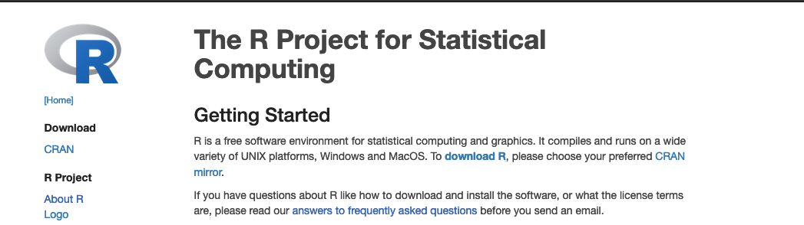
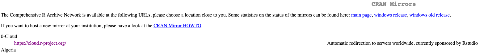
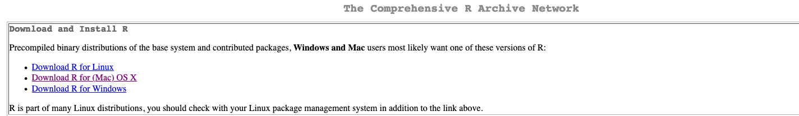
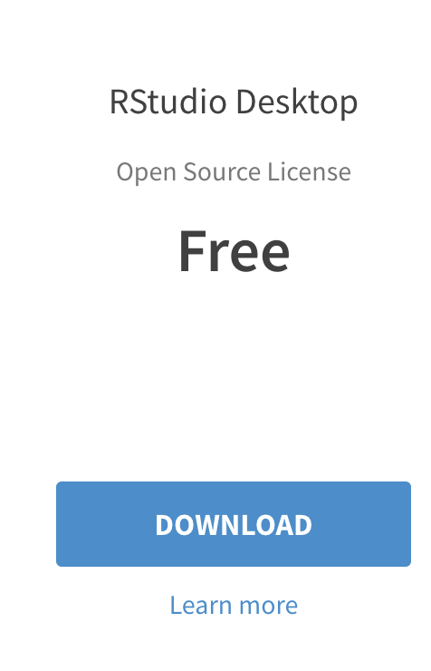
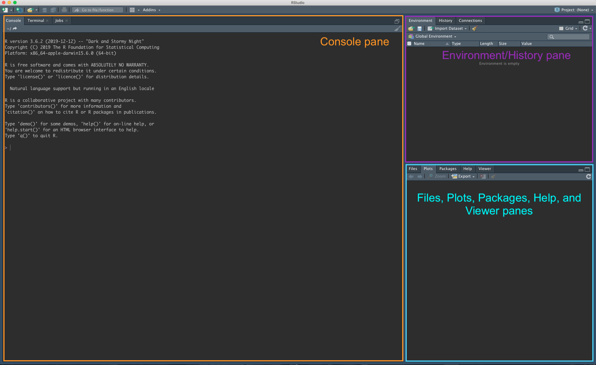
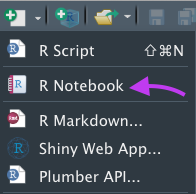
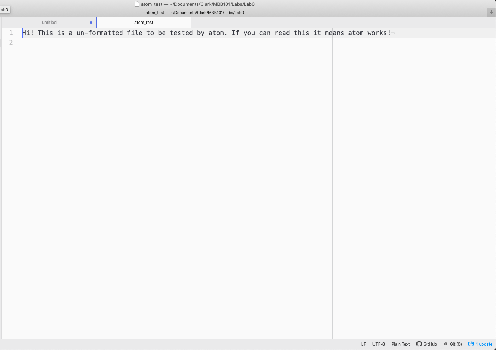

# Software for class {#software}

```{block, type='objectives'}

**Objectives:**

1. To familiarize ourselves with the main software used in class
2. To install programs used for basic quantitative biology
3. To perform basic tests of functionality of these programs
```

As I mentioned in the previous chapter,  we are going to use *R, RStudio* and the basic *UNIX command line* for our exercises, as well as  *atom*, a basic text editor that's widely used in programming to view and edit files.

## How to install R?

1. Open an internet browser and go to [www.r-project.org](www.r-project.org)

2. Click the "download R" link in the middle of the page.



3. Select a CRAN location (a mirror site) and click the corresponding link.  



4. Click on the "Download R for" your operating system link at the top of the page.


        
5. 
  - For Windows users: Click on the "install R for the first time" link at the top of the page. Run the `.exe` file and follow the installation instructions.  
  - For MacOS X users: Click on the "R-4.0.2.pkg" link to download the install package. Run the `.pkg` file and follow the installation instructions.  

## How to install RStudio?

1. Go to [www.rstudio.com](www.rstudio.com) and click on the "Download" link.


2. Click on "Download RStudio Desktop (FREE)" in the lower part of the page.



3. Click on the version recommended for your system. save the .exe/.dmg file on your computer, double-click it to open, and then drag and drop it to your applications folder.

## How to install Atom?

1. Go to the atom webpage at [https://atom.io/](https://atom.io/)
2. Click on Download.
3. 
  - In Mac OS: Move the application to the Applications folder
  - In Windows: Execute the `AtomSetup.exe` file
  
## How to install MATLAB?

1. Go to Clark's software webpage at [https://www.clarku.edu/offices/its/a-z-service-catalog/software-for-all/](https://www.clarku.edu/offices/its/a-z-service-catalog/software-for-all/)
2. Click on the text under MATLAB "Download".
3. You will be redirected to the mathworks website through Clark University.  After you click on `Sign in to get started`, you will need to follow the prompts to login using your Clark username.

***

# Testing the software

## Testing R and RStudio

1. Open your R studio after installation

3. You should see a window like this:



You should have three panes open (or probably four). The one in the left that says `R version XXX` is your *console*. Most of the code goes there, both input and output. 

On the upper right you have the *environment/history* pane. The environment stores and shows you all the files being used by the current R session that are saved in your RAM. We will rarely use the environment in this course, but its still an important feature to know how much memory is being used, how many files are loaded and if our objects are actually being used by R. The history panel will show you all the previously used code.

Finally, the lower right has the *Files, Plots, Packages, Help, and Viewer panes*. These panes show exactly that: The files in the folder you are in, the plots generated by R, the R packages that will be loaded, and the help for the different R packages. The Viewer panel is a special feature that is used by some packages, we will use it later.

4. Now, you will see the menu in the top. Click on the `new file` element and lets do our first R notebook.

5. Click on `new file`, and then `R notebook`



We will talk on class about R notebooks and why they are important for our course!


## Testing Atom

1. To test Atom, download the `atom_test` file from the moodle page

2. Open Atom in Applications

3. Use `File -> Open` and open `atom_test`

4. You should see this:



We will use Atom to open more of these kinds of files that have no programs associated with them! Atom can open any text file that is unformatted, as well as many scripts and programs. We won't go so deep into these other elements (Remember, this is an *Introduction* course!) but we can discuss them in the lab.

