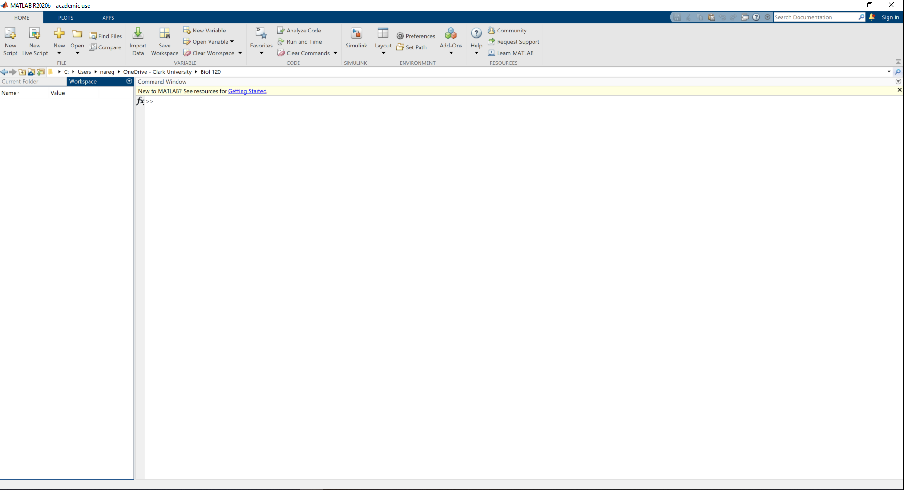
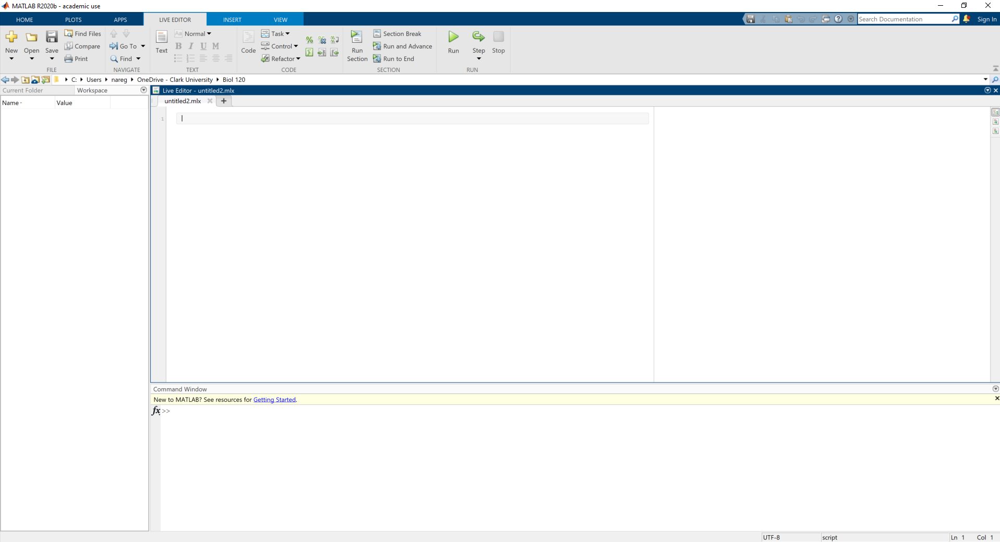

# Setting up software and working folders {#software}

```{block, type='objectives'}

**Objectives:**

1. To familiarize ourselves with our computer's file system

2. To set up working folders for organizing important files (data, scripts, etc...)

3. To familiarize ourselves with the main software used in class

4. To install programs used for basic quantitative biology

5. To perform basic tests of functionality of these programs
```


## How to set up working folders?

Wether you have a computer that runs MacOS or Windows, your will use a files system for navigating, creating, moving and deleting fils and folders (*Finder* for MacOS and *Explorer* for Windows). These are used to navigate through your locally stored files (on your computers hard drive or attached storage media)

Getting to know your way around your file system is like where you plates/silverware/cookware are in your kitchen. You need to know where things are stored, how to retrieve them when neeed and where you can put them for future use.

**Take a moment to browse your computer's file system. Look for downloads, documents, etc...**

Before we get started installing and using software it's important for you to create a `working folder`. That is, a folder in which you will store important files that we will use during our lab sessions.

**Create a folder labled Biol 120 and make sure you can navigate to it when necessary**

*Alternatively, this folder can be located in your OneDrive folder or Google Drive for remote access*

## Software for the class 

As was mentioned in the previous chapter,  we are going to use *MATLAB* for our exercises.

## How to install MATLAB?

1. Go to Clark's software webpage at [https://www.clarku.edu/offices/its/a-z-service-catalog/software-for-all/](https://www.clarku.edu/offices/its/a-z-service-catalog/software-for-all/)
2. Click on the text under MATLAB "Download".
3. You will be redirected to the mathworks website through Clark University.  After you click on `Sign in to get started`, you will need to follow the prompts to login using your Clark username.


***

# Testing the software

## Testing MATLAB

1. Launch MATLAB after installation

3. You should see a window like this:



You should have two panes open. 

The one on the left has two tabs that read `Current Folder` and `Workspace`. `Current Folder` refers to the folder in which you are currently working. `Workspace` is where you will find the variables and data structures that you will create and import into matlab as we work. 

On the right you have the *Command Window* pane. This is where you can enter single commands to be run by MATLAB (we will get into these in later labs).

Above these two panels, is the file directory you are currently working in. Use the `Browse to folder` button to navigate to the Biol 120 working folder you created earler.

Much of our documentation and code building will be done with MATLAB live scripts. In the top left corner of the window, you should find the `New Live Script` button. Pressing this button will create a new set of panels.




In the newly created `Live Editor` panel, you will see you are working on a new untitled livescript `untitled.mlx`. 

Your `Live Editor` panel will be split into to panes. 

On the left is the portion that is editable by you. In a future lab session, you will see how we can add text, images and executable code into this pane.

The right pane is where any outputs of our code will be rendered (this will include graphs)

**That's it for Matlab. Go ahead and exit out**

