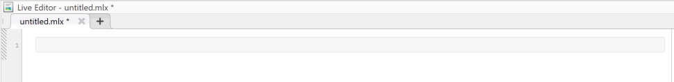
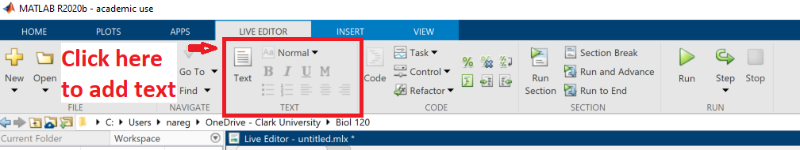
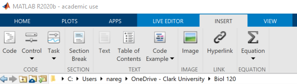
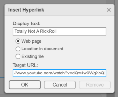
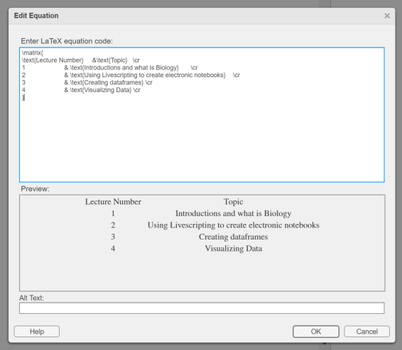
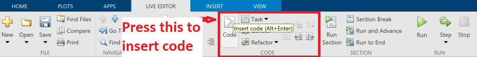
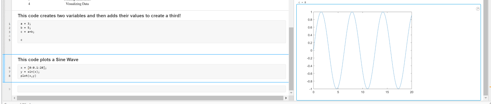

# Introduction to electronic notebooks with MATLAB Livescripts {#rmark}

```{block, type='objectives'}

**Objectives:**

1. To create electronic notebooks for course
2. To familiarize ourselves with the use of MATLAB livescripting and its features
3. To create our initial livescript document
4. To understand the importance of replicable and reproducible notebooks
```

The electronic lab notebooks we will use will in class will be created as `MATLAB livescript documents`. 

Livescripting with MATLAB allows us to create widely usable documents that will include any code we might write as well as its outputs. For more information about livescripting follow the link below:
<https://www.mathworks.com/help/matlab/matlab_prog/what-is-a-live-script-or-function.html>.

When you finish compiling a livescript, you can export it as an accessible document format such as .docx, .html or LATEX. 

## Livescript as an Electronic Notebook

We will use livescripting in MATLAB as it will allow us to create documents that we can modify in different computers (as long as we have MATLAB installed).

We will use these documents as *Electronic Lab Notebooks (ELS)*. These ELSs will be used to write down what you have done in class, save any code you have written as well as the results produced. They will also serve as a reference for your file locations.

But, before we go into the super complex part of it, lets learn the basics of livescripting with MATLAB.

***

**Open MATLAB, navigate to your Biol120 working folder and start a NEW livescript**

***
## Basics of Livescripting

In order to use LiveScripts as Electronic Notebooks let's familiarize ourselves with the interface and methods for editing our document. 

 **When building a livescript, you will be switching between editing text and code. in the sections below, we will review the process**

### Editing Text 

Whenever you begin a new livescript, the first thing you will notice is a grey bar in your left panel. (see below)




This is because MATLAB defaults to editing code when a new LiveScript is made. In order to edit this document with plain text, add images, etc... we must first click the `Text` button to enter text editing mode.




In the `Text Panel` you will see text editing controls that you might be familiar with from text editors such as MSWORD. 

**Experiment with different text formats (Normal, Header, Title) and think about how you might structure a document to be comprised of a Title, Headers for specific sections and normal text.**

You also have the usual text formatting such as **BOLD**, *ITALIC*, etc... as well as the ability create Bullet Lists, Numbered Lists and change the justification.

**Experiment creating different blocks of text with the formatting controls**

***

### Inserting Figures, Hyperlinks and Equations

Finally, we can add figures, hyperlinks and equations using the ` in the Markdown document `Insert` tab. (See below)



#### Figures

Using the Image button, you can browse to and insert an image of your choice. This could be a figure or image relevant to what you are doing for your current lab assignment.

*Once you've inserted your image you can size it to your preference*

**Use a combination of a text header and the `Image` button to insert an image into your livescript**

**NOTE: THIS IS A PERFECT OPORTUNITY TO START THINKING OF WHERE YOU MIGHT STORE RELEVANT FILES IN YOUR WORKING FOLDER**


#### Hyperlinks

To add a hyperlink to your livescript use the `Hyperlink` button and follow the instructions in the dialog box that pops up. You should format your links to have some descriptive text and then input the url



**Here's an example Hyperlink**

[Totally Not A RickRoll](https://www.youtube.com/watch?v=dQw4w9WgXcQ)

#### Tables (Using Equations)

Inserting tables is tricky and annoying with the only available solution being to create a matrix with LATEX code. Coppy the code below and use the `Equation` button to insert it as a Latex Equation (see image)


```
\matrix{
\text{Lecture Number}    	&\text{Topic}   \cr
1			& \text{Introductions and what is Biology} 	\cr
2			& \text{Using Livescripting to create electronic notebooks} 	\cr
3			& \text{Creating dataframes} \cr
4	                & \text{Visualizing Data} \cr
}
```




**Later in the semester we will learn how to load in data and output tables with them.**

***

### CODE!

Along with our plain text, figures, etc..., we will be adding in sections of executable code to our electronic notebooks, allowing us to execute and log analyses of our data.

In order to switch to code editing, you must press the `Code` button in the `Live Editor` tab



**NOTE: WHEN INSERTING CODE INTO YOUR LIVESCRIPT IT'S USEFULL TO INSERT SECTION BREAKS BEFORE AND AFTER SO THAT YOU CAN ONLY RUN SPECIFIC SETS OF CODE AT A TIME

You can also use plain text to annotate your code.

**Create two sections of code by inserting section breaks and copying the following code**

```
This code creates two variables and then adds their values to create a third!
a = 3;
b = 5;
c = a+b;

c
```

```
This code plots a Sine Wave
x = [0:0.1:20];
y = sin(x);
plot(x,y)
```

After you've created the sections of code, use the `Run Section` button and observe the outputs

**You should notice that if you click on the ouput on the right panel, the corresponding section of code will be highlighted**



**Annotating your code is the best way to remember what your code does and log how you were able to accomplish specific tasks with specific lines of code.**

***

## LiveScript Exercise:

```{block, type='rmdquestion'}
Create a Live Script that describes yourself in a simple manner. Use as many element of syntax as possible, like *bold text*, **italics**, lists, tables and even add a picture of yourself. You can make it a very simple resume, a simple CV or just a small paragraph of you and your likes.
```

***

**Save your example LiveScript in a folder for today's lab session**

***

## Additional information on LiveScripting

- [What is a LiveScript](https://www.mathworks.com/help/matlab/matlab_prog/what-is-a-live-script-or-function.html)
- [Formatting for Livescripts](https://www.mathworks.com/help/matlab/matlab_prog/format-live-scripts.html)
- [Simple Example MATLAB Code](https://www.public.asu.edu/~hhuang38/hph_matlab_basic2013_1.pdf)


