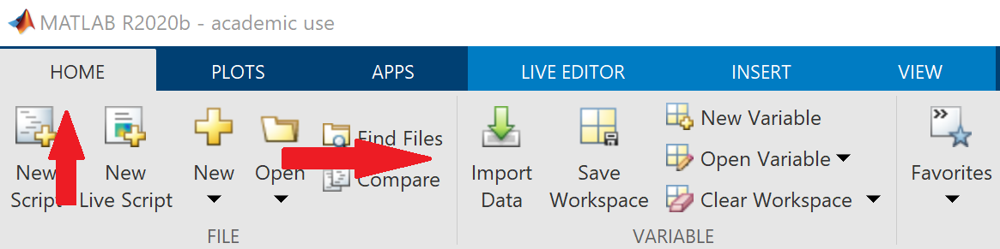
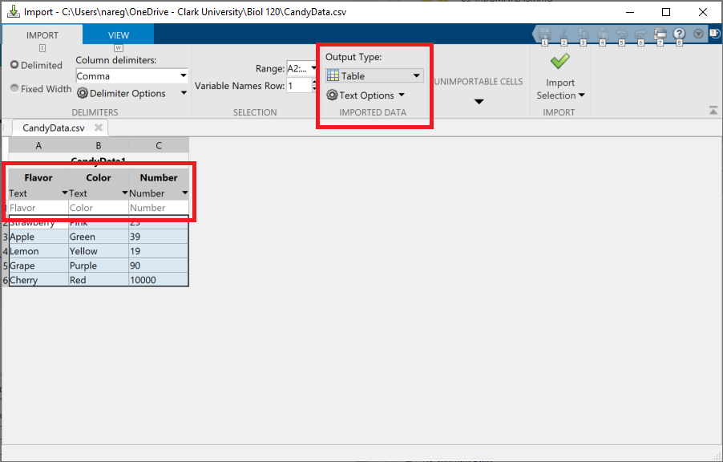
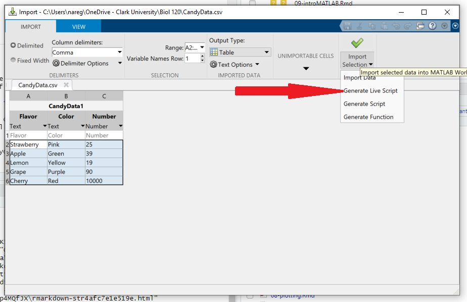
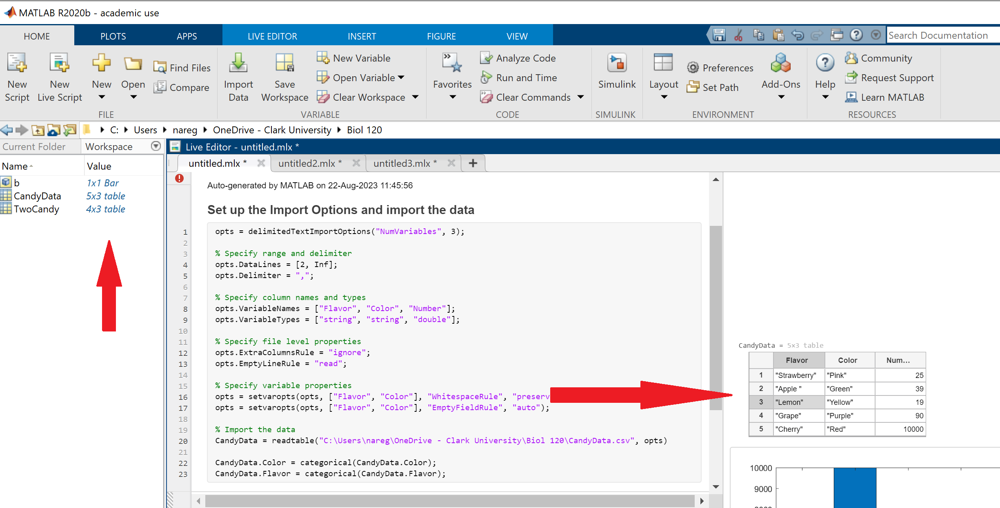

# Creating datasets and replicability {#datasets}

```{block, type='objectives'}

**Objectives:**

1. To use the scientific method for data analysis
2. To generate research questions based on our observations
3. To create data sets based on metrics of interest
4. To open and use data sets in a computational environment
```

```{block, type='objectives'}
**Checklist**

Before we begin, be sure you've prepared the following:

1. Open Matlab.
2. Navigate to your Biol120 working folder and create a new folder for today's lab.
3. Open a new live script and use the header text to place the title for today's lab.
4. Get a notebook out for writing in.
```

Today's laboratory will be focused in the essentials of building data sets.

Data sets can be built with absolutely anything you can make an observation from and ask a question about.

Before we start, however, write out the answers to these questions in your livescript:

```{block, type='rmdquestion'}
#### Question 1

- What are the main steps of the scientific method?
- How do you define a research question?
- What is the difference between a research question and a hypothesis?

```

## Creating basic datasets

So, we have a bag of candy in front of us. 

Bags of candy have several different elements on it: The various flavors, the diversity in colors. Some may have different shapes, ect.

The objective for today is to ask research questions and create a dataset that allows you to answer different questions based on your research focus (in this case, *your candy bag*)

## Asking biological questions and identifying measurable outcomes

1. Create groups of two students
2. Open the bag of candy and generate some observations about it. It can be about anything you find interesting or peaks your interest

```{block, type='rmdquestion'}
#### Question 2

Create at least three observations from tour research object and add them to your livescript:

 -
 -
 -
```

3. Choose one observation and create a research question and a hypothesis for it. Write them out in your livescript

```{block, type='rmdquestion'}
#### Question 3

- **Research Question**:
   -

- **Hypothesis**
   -
```

4. Using a **physical notebook**, have a list of **variables** you think would be directly measurable to test your hypothesis

```{block, type='rmdquestion'}
#### Question 5

Consider how you have arranged your data in terms of rows and colomns.
If you were to graph this data, which would go in the X axis and which would go in the Y axis?
Write your answers in the livescript

```

5. Measure the variables and write down the results in the same physical notebook. 

```{block, type='rmdquestion'}
#### Question 6

Take a photo of the page of the notebook and add it to your livescript.
```

6. Did your results answer your research question? How about your hypothesis?

```{block, type='rmdquestion'}
#### Question 7

- **Research Question**:
   -

- **Hypothesis**
   -
```


***

## Digitizing your data

1. Using the same dataset, organize your data in a simple data frame using [Google Sheets](https://www.google.com/sheets/about/) 

2. Download your datasheet as a `.csv` in the folder for today's lab.

```{block, type='rmdwarning'}
#### WARNING:

Be mindful of the name you choose (IE CandyData)

Do **NOT** name any of your files with a space or with weird characters (such as `?><,/';:[]{}=+-`). 

If you need to use a space, use an underscore (`_`) or separate the names using `camel case` (i.e. Instead of `data sheet candy.txt` use either `data_sheet_candy.csv` or `dataSheetCandy.csv`)
```


3. To bring your data into matlab where we can work with it, we will use the `Import Data` button in the `Home` tab




Navigate to the file you just downloaded and open it.

In the dialogue box that opens, you will see a LOT of options.



First focus on the table itself.

You will see that MATLAB has recognized that the top row contains the names of our variables (In the image we have "Flavor", "Color" and "Number") and it has recognized the contents of those cells as either "Text" or "Number"

**It's important for us to see how MATLAB is recognizing our data as it will affect how we work with it in the future**

Secondly, you will see that matlab has options for how to output the data, the default being as a table. For today and this week, we will choose this default option. In subsequent weeks we will learn about these data types and how to work with them.

Now let's turn our attention to the "Import Selection" button. When you click on the arrow, you should get some options.

You *could* simply import the data by clicking on the checkmark, but that would **NOT BE A GOOD WAY TO LOG WHAT YOU'VE DONE**

So instead, we will choose `Generate Live Script`



**Copy the generated livescript and paste it into your own.**

Edit the title to read "Import CandyData (Or whatever you named your data file)"

***
```
LET's DISCUSS THE CODE FOR A MINUTE
```
***

4. Run the imported sections of code.

You should now see the data in your workspace and your table in the output panel.



In your livescript note the following:

```{block, type='rmdquestion'}
#### Question 8
   
   - What did the code you copied do?
   - What are the names of your columns?
   - What do each of your columns represent?
   - Write if your results are able to test your hypothesis and give an explanation why
   - If you were to graph these data, what would go on the X axis and what would go on the Y axis?
```

***

## Creating basic plots in MATLAB

Now that you have digitized your dataset, we can take advantage of some functions in MATLAB to visualize them and get a get understanding of what's going on.


We will start with a simple bar plot.

A bar plot summarizes all the information for each **category** (i.e. The element you are using to qualify the data into different sets) in the **x-axis** and creates bars in the **y-axis** where the height represents the number of data points for said category.


***
Whenever you call a function in MATLAB, you start with the name of the function (I.E. bar for barplot)

This is then followed by input arguments that tell the function what to do (I.E. Data for X axis and Data for Y Axis)

Here's an example use of the bar plot function

bar(XaxisData,YaxisData)

We will input the variable names from our table for the XaxisData and YaxisData

***

**Create a new section for writing code by inserting a section break**

Annotate and copy the following command


**Creates a bar plot of my data**
```
bar(CandyData.Flavor,CandyData.Number);
```
```{block, type='rmdwarning'}
If be mindfull of the names of your variables. In my example I had used the column headings of "Flavor" and "Number" this is where you will input your own column names depending on how you named your variables.
```


End the section with another section break and run the code.


```{block, type='rmdquestion'}
#### Question 9
  -  Is this an easier way of understanding your data? Explain why.
```

***

##  Comparisons between groups.

Now, lets see how our data collection is compared to the other groups

1. Get together with another group
2. Compare your two data collections and answer the following in your livescript:

```{block, type='rmdquestion'}
#### Question 10

   - What was the question the other group asked?
   - Did they data collection help them answer this question?
```

3. Import their data set into your `MATLAB` environment. That means to ask them for their original, hand written data sheet and re-digitize it using `Google Sheets` 

```{block, type='rmdquestion'}
#### Question 11
   
   - Load the data sheet into `MATLAB` by generating a livescript, copying, annotating and running the code.
   - Compare it to their digital data sheet. Is it identical?
```

4. Now, talk to the other group and start thinking of a way to measure the differences between the two data sets.

```{block, type='rmdinfo'}
#### Asking questions

For example: One group has M&Ms and the other has Skittles or Starburst. What are two features in common these two candies have? Color? Flavors?

You can, for example, measure the number of colors for both Skittles/Starburst and M&M's and compare them. Or, can measure the flavors in Skittles and Starburst and compare those.
```

```{block, type='rmdquestion'}
#### Question 12
   
- **Research Question**:
   -

- **Hypothesis**
   -
```

5. Create a **digital data frame** with these two data sets.

```{block, type='rmdwarning'}
BE CAREFUL! THINK ABOUT HOW YOU MUST ARRANGE YOUR VARIABLES SO THAT ONE COLUMN IS CATEGORIES (Colors, Flavors) AND THE OTHER TWO COLUMNS ARE NUMBERS (Labeled Skittles/M&Ms/Starburst)
```


```{block, type='rmdquestion'}
#### Question 13
   
   - Load the data sheet into `MATLAB` by generating a livescript, copying, annotating and running the code.
```

6. Lets create a plot to compare the two different candies

```{block, type='rmdinfo'}
#### Comparing data sets

When you want to compare between different sites/treatments/types of candies, it's important that the data frame has an extra column that tell you where these are from.
```

**Create a new section for adding code with a section break**

Annotate and copy the code below

**Creates a grouped bar plot comparing the two types of candy**
```
bar(TwoCandy.Flavor,TwoCandy{:,2:3});
legend(TwoCandy.Properties.VariableNames(2:3));
```

**End the section with a section break and run the code**

***
You may have noticed some extra arguments in the code for creating a grouped bar graph. We will go into more details about these in next week's discussions.
***

#### Question 14
   - Can this graph help you answer your research question? How?
   - What do your results show, based on the research question?
   - Compare the code for plotting the `two_candies` data set versus the code for the `my_data` data set. What changed?
   
```


