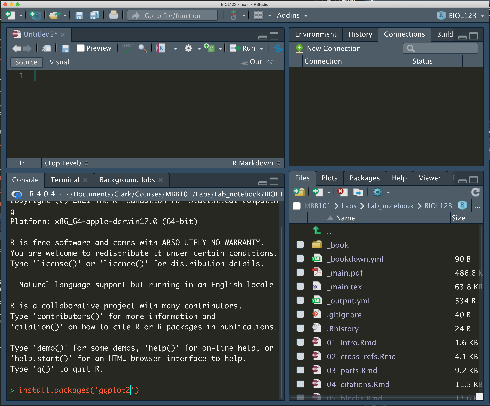
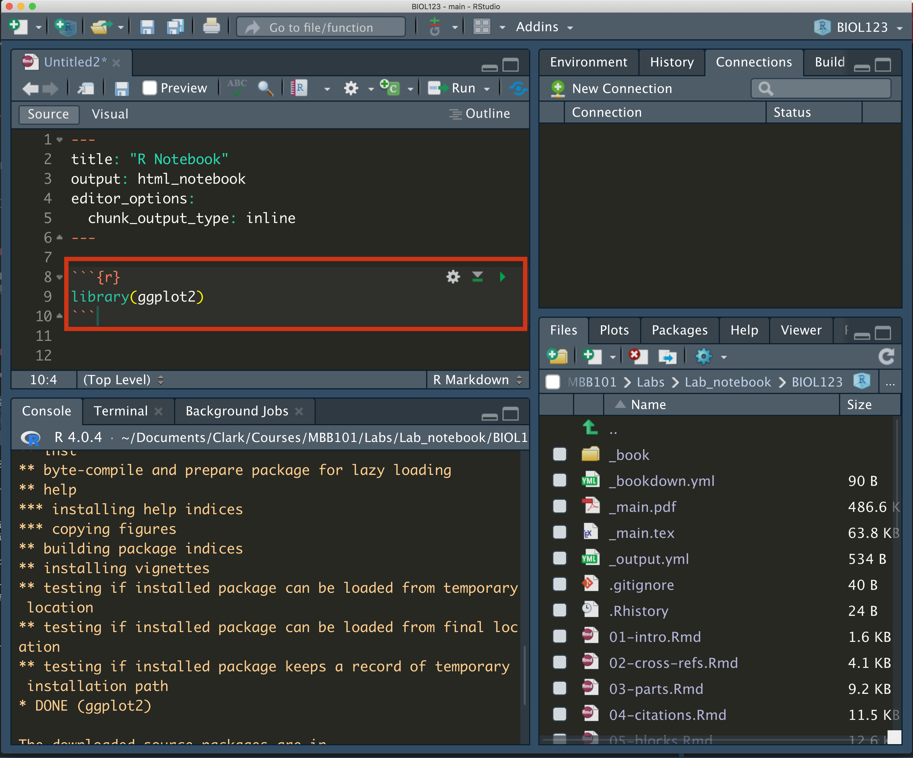

# Creating datasets and replicability {#datasets}

```{block, type='objectives'}

**Objectives:**

1. To use the scientific method for data analysis
2. To generate research questions based on our observations
3. To create data sets based on metrics of interest
4. To open and use data sets in a computational environment
```


Today's laboratory will be focused in the essentials of building data sets.

Data sets can be built with absolutely anything you can make an observation from and ask a question about.

Before we start, however, lets answer these questions:

```{block, type='rmdquestion'}
#### Question 1

- What are the main steps of the scientific method?
- How do you define a research question?
- What is the difference between a research question and a hypothesis?

```

## Creating basic datasets

So, we have a bag of candy in front of us. 

Bags of candy have several different elements on it: The various flavors, the diversity in colors. Some may have different shapes, ect.

The objective for today is to ask research questions and create a dataset that allows you to answer different questions based on your research focus (in this case, *your candy bag*)

## Asking biological questions and identifying measurable outcomes

1. Create groups of two students
2. Open the bag of candy and generate some observations about it. It can be about anything you find interesting or peaks your interest

```{block, type='rmdquestion'}
#### Question 2

Create at least three observations from tour research object and add them here:

 -
 -
 -
```

3. Choose one observation and create a research question and a hypothesis for it

```{block, type='rmdquestion'}
#### Question 3

- **Research Question**:
   -

- **Hypothesis**
   -
```

4. Using a **physical notebook**, have a list of **variables** you think would be directly measurable to test your hypothesis

5. Measure the variables and write down the results in the same physical notebook. 

```{block, type='rmdquestion'}
#### Question 4

Take a photo of the page of the notebook and add it here.
```

6. Did your results answer your research question? How about your hypothesis?

```{block, type='rmdquestion'}
#### Question 5

- **Research Question**:
   -

- **Hypothesis**
   -
```


***

## Creating a clean raw dataset

1. Using the same dataset, organize your data in a simple data frame using [Google Sheets](https://www.google.com/sheets/about/) or [EtherCalc](https://ethercalc.net/)

2. Copy your spreadsheet into `atom`, paste it and save it file into a folder in your desktop called `BIOL120` with a `txt` extension (something like `data_sheet_candy.txt`)

```{block, type='rmdwarning'}
#### WARNING:

Do **NOT** save any of your files with a space or with weird characters (such as `?><,/';:[]{}=+-`). 

If you need to use a space, use an underscore (`_`) or separate the names using `camel case` (i.e. Instead of `data sheet candy.txt` use either `data_sheet_candy.txt` or `dataSheetCandy.txt`)
```


3. In your `R studio`, go to the `Session` menu in the toolbar, select `Set Working Directory` and select your `BIOL120` folder

4. Run the following code **after changing the name of the .csv file into what you named it** 

```{r df_load}
my_data <- read.table('data_sheet_candy.txt', header = T)
```


> i.e. If my file is called `dataset.txt`, then I change the code to `read.table('dataset.txt')`

```{block, type='rmdinfo'}

#### Executable Code Chunks

Executable code chunks are sections in your R markdown that allow you to **execute** or run code inside your file! That means you can do a lot of cool stuff within those chunks, like read datasets, create tables, and plot figures.

Executable code chunks look like this:

<pre><code>```{coding language goes here}
code goes here
```</code></pre>

That means we can use `bash`, `R` and even `python` (as long as you have installed the correct packages) inside your R markdown document.

An example using `bash` to get the time:

<pre><code>```{bash}
date
```</code></pre>

```{bash, echo=F}
date
```

```{block, type='rmdinfo'}

You can also use `R` as in here:

<pre><code>```{r}
(my_data <- read.table('data_sheet_candy.txt', header = T))
```</code></pre>

```{r, echo = F}
(my_data <- read.table('data_sheet_candy.txt', header = T))
```


5. Check your file loaded by using the code `View(my_data)` or also adding this into your notebook and `kniting` the document:

```{r, echo=T}
my_data
```

6. In your R markdown notebook do the following:

```{block, type='rmdquestion'}
#### Question 6
   
   - Add the code to read and visualize the data frame
   - What are the names of your columns?
   - What do each of you columns represent?
   - Write if your results are able to test your hypothesis and give an explanation why
```

***

## Creating basic (basic) plots in R

Now that you have your data set readable by a computer program, we can do some very basic visualization to make it easier to interpret.

To do so, we need to install one simple `R package` that will allow us to create plots. This package is called [`ggplot`](https://ggplot2.tidyverse.org/index.html).

```{block, type='rmdinfo'}
#### R Packages

An R package are a collection of code, data, functions and other elements that allow you to extend the usage of `R`.

Some packages will help you plot, some others will allow you to read data into R in a better and faster way.

To use a package the first thing you have to do is **Install it**.
After the package is installed, you just need to load it into the library.


##### Installing a package

For example, to install `ggplot2`, write the following code just once in the **CONSOLE** (aka. The window in the lower left corner of your R studio)

`install.packages('ggplot2')`



If you check the console, you'll see that the code will say 

`DONE: ggplot2`

That means that your package has been installed.

##### Loading a package

Now, we need to load the package to get the functions to work. 

To load the package, in your `R markdown` add this in code block

\```{r}
library(ggplot2)
\```



The command `library` loads the package into your `R` environment, and now you can use any of its functions!

To learn more about packages in `R`, read the following [link](https://hbctraining.github.io/Intro-to-R-flipped/lessons/04_introR_packages.html)

```


1. Load the `ggplot2` package (make sure you have installed it first)

2. Make sure your data frame is still loaded into `R`.

```{block, type='rmdquestion'}
#### Question 7
   
   - How would you check that the data frame is still loaded in R? Write the code and a justification
```


3. Now, lets do a basic plot. Chances are that your data set has a set of columns with the colors/flavors/shapes in one column and the number of said elements in a second column. 

If this is the case, you can create a simple **bar plot**. A bar plot summarizes all the information for each **category** (i.e. The element you are using to qualify the data into different sets) in the **x-axis** and creates bars in the **y-axis** where the height represents the number of data points for said category.

To create the plot, modify and execute the following code:

```{r bar_plot}
library(ggplot2)
ggplot(data=my_data, aes(x=Flavor, y=Number)) + geom_bar(stat='identity')
```

```{block, type='rmdquestion'}
#### Question 8
  -  Is this an easier way of comparing your data? Explain why.
```

***

##  Comparisons between groups.

Now, lets see how our data collection is compared to the other groups

1. Get together with another group
2. Compare your two data collections and answer the following:

```{block, type='rmdquestion'}
#### Question 9

   - What was the question the other group asked?
   - Did they data collection help them answer this question?
```

3. Import their data set into your `R` environment. That means to ask them for their original, hand written data sheet and re-digitize it using `Google Sheets` or `EtherCalc`

```{block, type='rmdquestion'}
#### Question 10
   
   - Load the data sheet into `R` and show it in your Markdown notebook 
   - Compare it to their digital data sheet. Is it identical?
```

4. Now, talk to the other group and start thinking of a way to measure the differences between the two data sets.

```{block, type='rmdinfo'}
#### Asking questions

For example: One group has M&Ms and the other has Skittles. What are two features in common these two candies have? Color? Flavors?

You can, for example, measure the number of colors for both Skittles and M&M's and compare them
```

```{block, type='rmdquestion'}
#### Question 11
   
- **Research Question**:
   -

- **Hypothesis**
   -
```

5. Create a **digital data frame** with these two comparison and add them to `R`

```{block, type='rmdquestion'}
#### Question 12
   
   - Load the data sheet into `R` and show it in your Markdown notebook 
```

6. Lets create a plot to compare the two different candies

```{block, type='rmdinfo'}
#### Comparing data sets

When you want to compare between different sites/treatments/types of candies is important that the data frame has an extra column that tell you where these are from. 

For example:

| Flavor       | Number | Candy     |
|--------------|--------|-----------|
| Lime         | 12     | Skittles  |
| Lemon        | 13     | Skittles  |
| Banana       | 55     | Skittles  |
| Strawberries | 23     | Skittles  |
| Lime         | 5      | Starburst |
| Lemon        | 0      | Starburst |
| Banana       | 12     | Starburst |
| Strawberries | 3      | Starburst |

In this case, we can separate the flavors from each candy. 
```

Modify the following code with your column names:

```{r, show=F, echo=FALSE}
two_candies <- read.table('data_sheet_two_candies.txt', header = T)
```

```{r two_candy_plot}
ggplot(data=two_candies, aes(x=Flavor, y=Number, fill=Candy)) +
  geom_bar(stat='identity', position="dodge")
```

```{block, type='rmdquestion'}
#### Question 13
   - Can this graph help you answer your research question? How
   - What do your results show, based on the research question?
   - Compare the code for plotting the `two_candies` data set versus the code for the `my_data` data set. What changed? 
   
```
