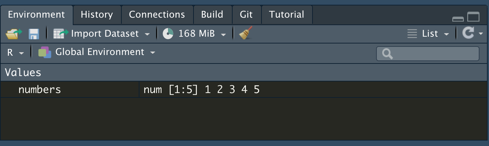

# Basic R (1): Vectors {#vectors}

```{block, type='objectives'}

**Objectives:**

1. To understand what an object is
2. To identify vectors
3. To learn how to differentiate types of vectors
```

This chapter will focus on how to start using `R` for biological data sets and quantitative analysis. 

As we have seen in class, `R` is incredibly powerful for data analysis. But to be able to use it correctly we will have to understand the different types of data structures in R.

## Basic data structures in R

A basic data structure is an n-dimensional object that will store information. Examples of data structures R can handle are vectors, matrices, arrays, data frames and lists. 

Data structures in R can be classified according to the number of dimensions:

1. Uni-dimensional data structures such as **vectors**
2. Two-dimensional data structures such as **data frames** or **matrices**
3. N-dimensional data structures such as **lists** (Dont worry about lists for class)


```{r}
# One dimensional objects
c(1,2,3,4,5)

c("A","B","C","D","E")

# Two dimensional objects
data.frame(c(1,2,3,4,5), c("A","B","C","D","E"))
```

```{block, type='rmdinfo'}
### Objects

`R`is able to store any type of variable into an **object**. To create and object what you have to do is place the name of your object followed by `<-`, then followed by what you want to store there.

For example, if we want to store the set of numbers in the previous example in an object called `numbers`
we will do the following:

```

```{r}
numbers <- c(1,2,3,4,5)
```

```{block, type='rmdinfo'}
You will see in your Environment pane (upper right) that a new object, called `numbers` is there:



That means your object has been created.

To check that your object exists, then just write the name of your object in either the `R` console or your R markdown `R` chunk block and execute it (hit the play button ion your chunk)
```


```{r}
numbers
```

***

## Unidimensional objects: Vectors

It has only one dimension, like a table that only has either columns or rows. So, a "list" of infinite objects in only one direction.

This one-dimension object is called a **vector**, vectors look like this:

```{r}
numbers <- c(1,2,3,4,5)
letters <- c("A","B","C","D")
```

To initiate a vector object, use the `c()` style. This will invoke a vector that will be filled with the content separated by commas.

so, when we call them in R, they look like this:

```{r}
numbers
letters
```

Note that there is no info about rows or columns. That means you are working with vectors.

```{block, type='rmdinfo'}
###  R Functions

The `c()` command is also called a function. 

Functions are the commands that `R` uses to interpret an order.

In the case of `c()`, it means `Combine Values into a Vector or List`

The way the `R` syntax works is like this:

`function(object)`

So, for example, if you want to measure the length of an object you use the function `length` and the object between parenthesis:
```

```{r}
length(numbers)
```


```{block, type='rmdquestion'}
#### Question 1
   
- Create three vectors:
    - One named `words` with your five favorite words
    - One named `numbers` with your lucky numbers
    - One with three numbers and three letters in any order and name it `mixed`

- Show the code you used to create the vectors
```


### Classes of vectors

Another important command to know if your object is a vector is the `class` command:

```{r}
class(numbers)
class(letters)
```

The results shows that we either have `integers` or `characters`. These represent vectors of the same type: An integer vector is comprised by numbers, while a character vector is comprised by letters (or other letter-like characters). **Character** vectors can be identified because the elements in the vector are surrounded by quotation marks ("), while an integer is not

```{block, type='rmdquestion'}
#### Question 2
   
- Which are the classes of the `words`, `numbers` and `mixed` objects?
```

When you read this sentence please clap real loud and call wither Prof. Dresch or me.

### Expanding vectors

If you have two vectors of the same class, you can expand them by using the `c()` command again:

```{r}
# I want to create a vector of letters times 2 (So each letter twice)
double.letters <- c(letters, letters)
double.letters
# Same with numbers
double.numbers <- c(numbers, numbers)
double.numbers
# Or I want to add more numbers to my vector:
more.numbers <- c(numbers, 6, 7, 8, 9, 10)
more.numbers
```
 
```{block, type='rmdquestion'}
#### Question 3

- Increase each of your vectors by two or three more elements and add the code and the results.
- Create an object that combines your `words` and `numbers` vectors. Add the code.
- What are the classes of each of the objects you created?
```

