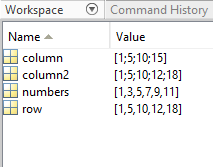

# Datasets Pt2 : Working with Vectors and Matrices in Matlab {#vectors}

```{block, type='rmdwarning'}
**For today's activity, reunite with your original partners and go through the steps below. After you have completed the tasks and can work with vectors, matrices and tables, finish the comparison of two groups' datasets**
```


```{block, type='objectives'}

**Objectives:**

1. To understand what an object is
2. To identify vectors
3. To learn how to differentiate types of vectors
```

This chapter will focus on how to start using `Matlab` for biological data sets and quantitative analysis. 

As we have seen in class, `Matlab` is incredibly powerful for data analysis. But to be able to use it correctly we will have to understand the different types of data structures in Matlab.

## Basic data structures in Matlab

A basic data structure is an n-dimensional object that will store information. Examples of data structures Matlab can handle are vectors, matrices, arrays, and tables. 

Data structures in Matlab can be classified according to the number of dimensions:

1. Uni-dimensional data structures such as **vectors**
2. Two-dimensional data structures such as **tables** or **matrices**

***
In matlab, a **Vector** is a type of **Array** with one row or one column. It is the most basic way to store a series of values for one variable. By definition **Vectors** are **one dimensional**.

You can create two types of vectors. 

A **Row Vector** will have all of its values in one single row. 

A **Column Vector** will have all of its values in a single column.

A **Matrix** is an **Array** with two dimensions or, multiple **Rows** and **Columns**

In principle, Arrays can have any number of **dimensions** as you will see in later exercises.

***
## Row Vectors

**Try the code below to create row vectors**

```
# Define a Row vector

A Row vector can be defined in two ways. 
First, you can enter specific values by defining a variable as a vector and inputting the values in between brackets like so:

row = [1 5 10 12 18];

OR

row = [1, 5, 10, 12, 18];

```

**Try the code below to create a data range**

```
You can to define a range of values, with a simple command

numbers = [1:2:11];
```
**The number two in the middle defines an interval of two and will create a row vector starting from 1 and containing every second number until 11.**

***
## Column Vectors

A Column vector can be defined in a couple of ways as well.
First, like with row vectors, you can enter specific values but in order to delineate rows, you will use the semicolon “;” in between values.

**Try the command below**

```
column = [1; 5; 10; 15];
```
Check out your workspace where you can see your newly defined row and column vectors. Double click on them to see their contents.**

***

Another way to create a column vector is to transpose a row vector with the transpose function.

You can do this simply by defining one vector as the transposition of another.

Try the command below

```
column2 = row`;
```

The apostrophe will call the transpose function.

The transpose function can also be used to turn a column vector into a row vector.

```{block, type='rmdquestion'}

#### Question 1: Create a column vector with a number range from 0-20 with an interval of 2 your answer must include the code and we should be able to recognize it in your workspace
```


***
At this point your workspace should look like this:


***
## Matrices

A **Matrix** can be defined by inputting values for columns separated by semicolons to delineate new rows.

**Try this example**
```
matrix = [1 2 3; 4 5 6; 7 8 9];
```

**Create two row vectors "rowx" and "rowy" with the same number of values**

**To place one row below the other, use**
 
```
 matrix1 = [rowx ; rowy];
```

You can also create a matrix by combining two column vectors.

**Create two column vectors "column1" and "column2"**

**To combine them as a matrix, use**

```
matrix2 = [column1, column2];
```

``` {block, type='rmdquestion'}  
#### Question 2: Why, in creating the previous two matrices did we use different syntax (semicolon vs comma) when combining the two vectors?
```

***

## Make a table

```{block, type='rmdwarning'}
**For this section have ready your original data frame and that of the other group to which you will be comparing your data**
```

``` {block, type='rmdquestion'}  
#### Question 3: Create three column vectors that contain  1: Your categorical data, 2: Your numerical data and 3: The other group's numerical data and combine those three column vectors into a matrix
```

```{block, type='rmdwarning'}
**FOR THIS TO WORK ALL OF YOUR VECTORS MUST HAVE THE SAME NUMBER OF VALUES (be of the same dimension)**
```

***
Convert your matrix into a table - edit the code below to fit your data

```
CandyData = array2table(CandyArray,"VariableNames",{'OurCategoricalVariable','OurNumbers','TheirNumbers'});
CandyData.Numbers1 = double(CandyData.Numbers1);
CandyData.Numbers2 = double(CandyData.Numbers2);
CandyData.Flavors = categorical(CandyData.Flavors);
```

## Graph it!

**Creates a grouped bar plot comparing the two types of candy**
```
bar(CandyData.Flavor,CandyData{:,2:3});
legend(CandyData.Properties.VariableNames(2:3));
```

**End the section with a section break and run the code**

***
You may have noticed some extra arguments in the code for creating a grouped bar graph. What do you think they are doing?
***


```{block, type='rmdquestion'}
#### Question 4
   - Can this graph help you answer your research question? How?
   - What do your results show, based on the research question?
   - Compare the code for plotting the `two_candies` data set versus the code for the `my_data` data set. What changed?
   
```


