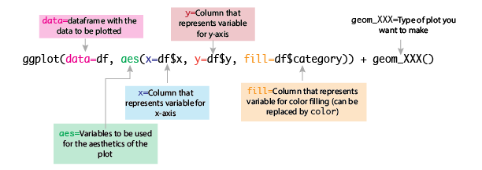

# Plotting data {#plots}

One of the clearest ways to present results or visualizing is by plotting it. This allows you to create a visual representation of it and come to conclusions about the patterns that you can see.

However, to plot data we need to understand two main things: Types of plots and how to plot them.

This chapter focuses on the use of the `ggplot2` package to plot different types of data.

## Using `ggplot2` to plot in `R`

The most commonly used package to plot data in `R` is `ggplot2`. This package uses a very simple syntax to plot:



So, when you are making a data frame you want to plot, make sure that all the variables in your data you want to add are in different columns.

## Different types of plots

We are going to test a set of different plots using one of `R`'s most used data sets: [`penguins`](https://allisonhorst.github.io/palmerpenguins/)! To install it (in case you want to test it) do `install.packages("palmerpenguins")` and load the library:

```{r}
library(ggplot2)
library(palmerpenguins)
data(penguins)
```

Give yourself some time to see what the data is about. 

### Histogram

A histogram is a representation of the **distribution of frequency (number of times) a continuous value** exists in our data set. 

Histograms are represented as bars. In the X-axis we have the continuous values and in the Y-axis the frequency of each value. In addition, the bars are also binned (divided into contiguous, equally spaced intervals).

So, if we want to make a histogram of the `flipper_length_mm` of the penguins, we can do it by include, then, the value at the `x=` variable and to include a `geom_bar()` option at the end. This `geom_bar` option tells `ggplot` that our plot is based on bars.

```{r}
ggplot(data = penguins, aes(x=flipper_length_mm)) + geom_bar()
```  

The plot, then, shows us that there are two main peaks of abundance of the flipper length: one around 190mm and another around 219. 

We can also add colors to separate between species, for example:

```{r}
ggplot(data = penguins, aes(x=flipper_length_mm, fill=species)) + geom_bar()
```

What we see, then, is that there are actually three peaks. One per species!

### Barplots

Bar plots are **representations of a continuous variable across discrete variables**. This means we need a Y-axis that has continuous data and an X-axis that contains discrete data. 

A good example of this would be the number of penguins per species per island. We have to do some transformations of the data first:

```{r}
library(tidyverse)
penguin.island <- penguins %>% count(species, island)
```

```{r}
penguin.island
```
And now, we create the plot using the n (number of penguins) in the y-axis and islands in the x-axis:

```{r}
ggplot(data = penguin.island, aes(x=island, y=n)) + geom_bar(stat = "identity")
```

The `stat="identity"` flags allows for the use of a continuous variable in the y-axis. 

We are still missing data, right? What happens if we want to see the species of penguins per island? Add a `fill=species` flag inside of the `aes`:

```{r}
ggplot(data = penguin.island, aes(x=island, y=n, fill=species)) + geom_bar(stat = "identity")
```
Now we can see that the Adelie species exists in all islands! This plot is called a **stacked bar chart**, because it stacks the different categories of each x rank in top of each other. 

There is a different type of bar chart that sets all the categories in the x-axis instead of on top of each other. To get this, add the flag `position="dodge"` into the `geom_bar` option: 

```{r}
ggplot(data = penguin.island, aes(x=island, y=n, fill=species)) + geom_bar(stat = "identity", position = "dodge")
```
In some cases, these charts are much easier to interpret as they compare the values directly between categories. 

### Scatterplots

Another super common type of plot are the scatter plots. Scatter plots represent **continuous variables versus continuous variables**. These plots are used for when we want to look at correlations between variables.

For example, do we see that beak depth increases with beak length?

```{r}
ggplot(data = penguins, aes(x=bill_depth_mm, y=bill_length_mm)) + geom_point()
```

So, we can see that each axis has continuous values. This plot its a bit hard to read, and that is because we don't really see a trend at all. Maybe if we color the points based on species the information will become clearer:


```{r}
ggplot(data = penguins, aes(x=bill_depth_mm, y=bill_length_mm, color=species)) + geom_point()
```

Much better! Now we can see a positive trend in the relation between bill depth and beak length per species, meaning that as one of these gets larger the other one also gets larger. 

More formal and statistical tests for correlation between discrete variables are seen in depth in biostatistics or other statistics courses, but with these plots you can expand your hypothesis and look for hints of correlations.

### Boxplots, violin plots and distributions

There are plots that combine histograms and categorical variables by **illustrating the distribution of the continuous variable across different categorical variables**:

These are called violin plots. If we want to see the distribution of `flipper_length_mm` per species, we can see it like this:

```{r}
ggplot(data = penguins, aes(x=species, y=flipper_length_mm, color=species)) + geom_violin()
```

These plots are constructed by the abundance of data points at each of the y-axis values, so we can add points to the plot:

```{r}
ggplot(data = penguins, aes(x=species, y=flipper_length_mm, color=species)) + geom_violin() + geom_jitter()
```

So, if you see the regions that have the widest area are the ones with the most points. That's how distributions are made!

These distributions, then, also provide you with the median and other statistically important elements that we will not focus on. You can see this simplification of the distribution you can use the `geom_boxplot` option:

```{r}
ggplot(data = penguins, aes(x=species, y=flipper_length_mm, color=species)) + geom_violin() + geom_jitter() + geom_boxplot()
```
The thick middle line in the box plot is the median, the upper and lower boxes represent the first and third quartiles (the 25th and 75th percentiles) of the data, and the error bars are the roughly 95% confidence interval for comparing medians.

***

## More resources on `ggplot2`

The `ggplot2` package is super extensive and has modifications and options to make whatever plot you'd like to make. 

Here are some great resources:

- https://ggplot2.tidyverse.org/index.html
- The [`ggplot2` official cheatsheet](https://github.com/rstudio/cheatsheets/blob/main/data-visualization-2.1.pdf)
- A phenomenal [practical guide to ggplot2](http://www.sthda.com/english/wiki/be-awesome-in-ggplot2-a-practical-guide-to-be-highly-effective-r-software-and-data-visualization)


