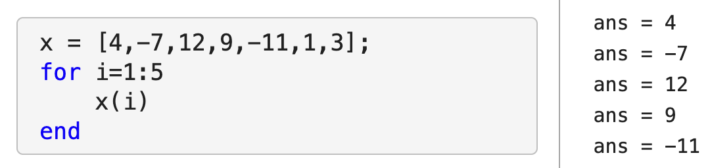
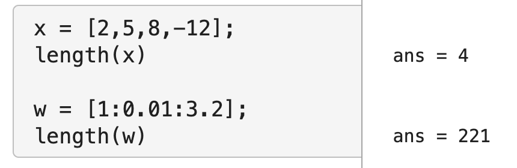
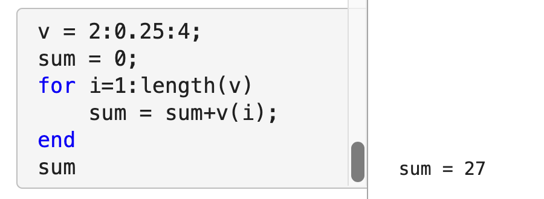
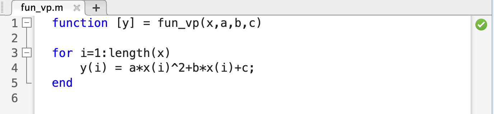
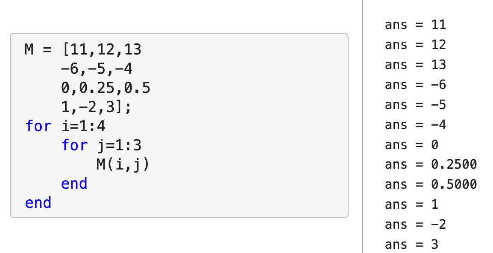
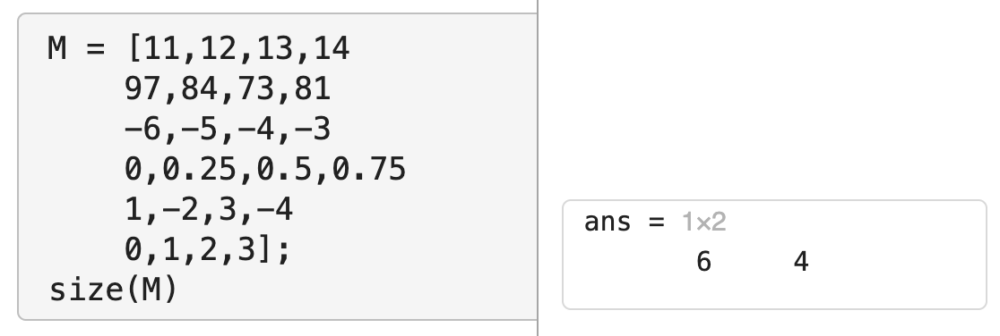
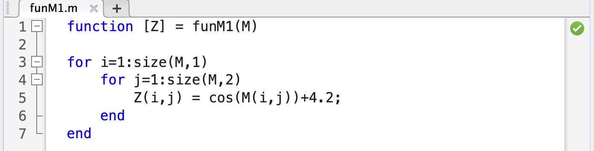
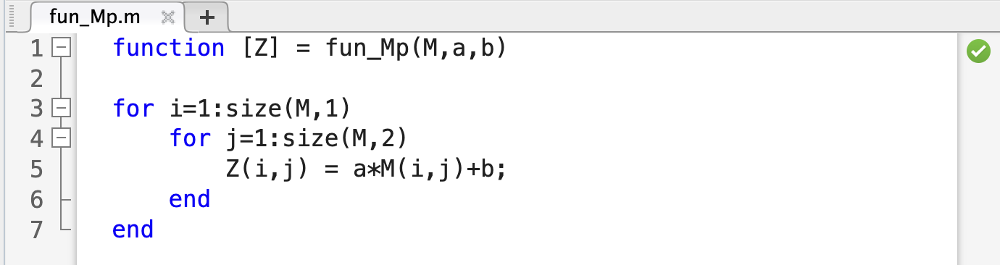

# Using for loops and Vector Manipulation

```{block, type='objectives'}
**Checklist**

Before we begin, be sure you've prepared the following:

1. Open MATLAB.
2. Navigate to your Biol120 working folder and create a new folder for today's lab.
3. Open a new live script and use the header text to place the title for today's lab.
```

Today's laboratory will be focused on using for loops effectively and manipulating vectors/matrices.  


Before we start, however, write out the answers to these questions in your live script:

```{block, type='rmdquestion'}
#### Question 1
State at least two scenarios where you would use a for loop.
```


## for loops

* Using a for loop
  + In your livescript:
  for i=1:(number of times)\\
\ \ \ \ \ (stuff to do)\\
end

  
  + Important parts include:
    1) The word `for`
    2) The variable to loop through (`i=`)
    3) The values that variable takes on while MATLAB works through the for loop (`1:5`)
    4) What you want to happen during each iteration (`x(i)`)
    5) The word `end` to signal that the for loop is over.
    
    
## Vector length
* Using the length command
  + Sometimes it is convenient to loop through an entire vector.  Why?
    1) You may want to access/print every element in a vector
    2) You may want to create a corresponding value for each element in a vector
  + MATLAB has a command to tell you how many elements are in a vector (i.e. how long a vector is).  This is the `length()` function.
  + To run the length function, all you need to do is give it a vector as input.
  
    ```{block, type='rmdquestion'}
#### Question 2
  - Create a vector, $v$, with all of the numbers from $2$ to $47$, using increments of $0.3$.
  - Using the `length` command, determine how many elements are in the vector $v$.
  - Go back to your midsemester project, where you created vectors with data that you plotted (either using a bar chart, scatter plot, or line plot).  Take one of those vectors of data and use the `length` command to determine its length. Note: be clear to put comments/text into your livescript to tell us what the data is that is included in this vector.
```

* Using a for loop to do some algebra
  + As we saw in class, you can use a for loop to do simple algebra (i.e. sum all of the numbers from 1 to 100).  Some things to note:
    1) you had to start the `sum` at 0 since 0 is the additive identity (any number added to 0 gives you that number back)
    2) you added to the `sum` variable iteratively inside the for loop
  + Similarly, we can add all of the elements of a vector, $v$.
      
  
    ```{block, type='rmdquestion'}
#### Question 3
  - Create a vector, $w$, with all of the numbers from $1$ to $2$, using increments of $0.1$.
  - Use a for loop to compute the product of all of the elements of w.  Hint: You don't want to start your product at 0 - you want to start it at the *multiplicative identity*.  
```  
  
## Vector manipulation: functions and for loops
* Writing a function with vector input(s) and output

  + Recall from Chapter 9: we can have a 'single' input with multiple values - i.e. input a *vector* of inputs
    
    Note: in this example, the output is also a vector.
  + We can also do this with a vector of inputs for our independent variable and parameters as other inputs as well.
    
    
  
    ```{block, type='rmdquestion'}
#### Question 4
  - Create a function for a linear model. This function should take as input a vector of $x$-values, and 2 parameters (one for the slope and one for the y-intercept) and output a corresponding vector of $y$-values.
  - Run your function with at least $3$ sets of different parameter values (i.e. choose different slopes and intercepts each time) and an $x$ vector with values ranging from $0$ to $10$. 
```  


## Nested (double) for loops
* Using a nested for loop to access/modify/create a matrix
  + In your livescript:
  for i=1:(number of rows)\\
\ \ \ \ \ for j=1:(number of columns)
\ \ \ \ \ \ \ \ \ \ (stuff to do)\\
\ \ \ \ \ end
end

 
  + Important parts include:
    1) The word `for`, the variable to loop through (`i=` and `j=`), and the values that variable takes on while MATLAB works through the for loop, for EACH of the two for loops.\\
      Note: it is IMPORTANT that you use two DIFFERENT variables for the two loops.
    2) What you want to happen during each iteration inside both loops.
    3) The word `end` to signal that the for loop is over for each of the loops.
    
    
    
## Matrix dimension    
* Using the size command
  + MATLAB has a command to tell you the dimensions of a matrix (i.e. the number of rows and columns).  This is the `size()` function.
  + To run the size function, all you need to do is give it a matrix as input.
  

    ```{block, type='rmdquestion'}
#### Question 5
  - Create the following matrix:
  $$M = \begin{bmatrix} 
0 \ \ \ \ \  \cfrac{7\pi}{6} \ \ \ \ \pi  \\ 
\cfrac{\pi}{6} \ \ \ \  \cfrac{5\pi}{4} \ \ \ \ 2\pi  \\
\cfrac{\pi}{4} \ \ \ \  \cfrac{4\pi}{3}  \ \ \ \ 3\pi \\
\cfrac{\pi}{3} \ \ \ \  \cfrac{3\pi}{2}  \ \ \ \ 4\pi \\
\end{bmatrix}$$
- Using the `size` command, determine the dimensions of the matrix $M$.
```  

## Matrix manipulation: functions and nested for loops
* Writing a function with matrix input(s) and output
  + Another way to have a 'single' input with multiple values is to input a *matrix* of inputs
    
    Note: in this example, the output is also a matrix.
  + We can also do this with a matrix of inputs for our independent variable and parameters as other inputs as well.
    
  
    ```{block, type='rmdquestion'}
#### Question 6
-  Create a function that transforms data from one matrix to another using the `sin` function and a constant vertical shift. The function you create should take as input a matrix of values for the independent variable, and 1 parameter (the value corresponding to the vertical shift). The output of this function should be a corresponding matrix, with each entry equal to the sine of the corresponding entry plus the vertical shift.\\
  Note: if $x$ is the entry in the original matrix and $b$ is the shift parameter, the corresponding entry, $y$ in the new matrix should be:
  $$y = sin(x)+b$$
  - Run your function using the matrix $M$ you created in Question 5 as the matrix of values for the independent variable and at least 2 different vertical shifts ($b$ values).
```  

```{block, type='objectives'}
**Submission**

Don't forget to submit your live script file (with all of the questions answered - via text or code) and any function files (m files) you have used in answering the questions on Canvas!
```
