# m files, functions, and Simple Plotting Tools


## m files:

* Creating an m file

  + `New` --$>$ `Script`
  + `Save` --$>$ `Save As..`
  + Name your file (the .m will automatically be added) and make sure it is saved in your `Current Folder`.
  
      Note: the `Current Folder` can be set using the curved arrow on the top of your main MATLAB window:
      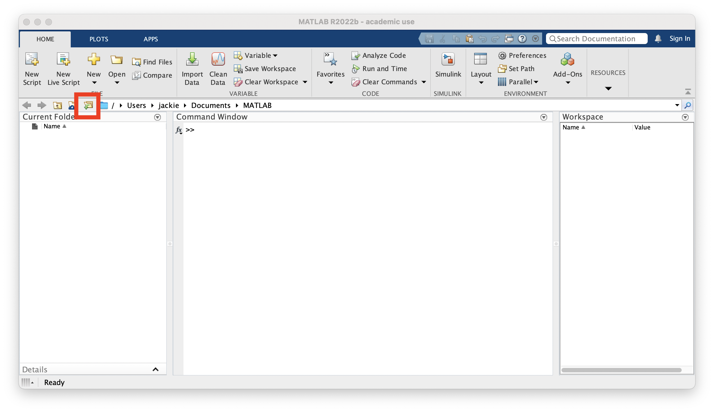
* What to put in an m file?
  + Any MATLAB commands you want to run (exacly as you would put them into the Command Window).
  + Comments (i.e. notes to yourself regarding what your code does)

    Comments in MATLAB are any text that follows a `%` symbol.
    
    The `%` symbol tells MATLAB not to execute that line of code.
    
     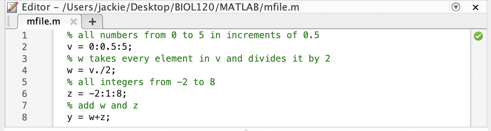

* Running an m file
  + Go back to the `Command Window`
  + Type in the name of your m file (without the .m)
  + When you hit enter, whatever MATLAB code is in your file will run
  + If your m file doesn't run, there is a good chance that your m file was not saved to your `Current Director'.  Double check that you have saved it in the correct location!
  + You can check that your m file ran by calling any of the variables that were defined in your m file (In the example below, I ran mfile.m and then checked the vector y.)
   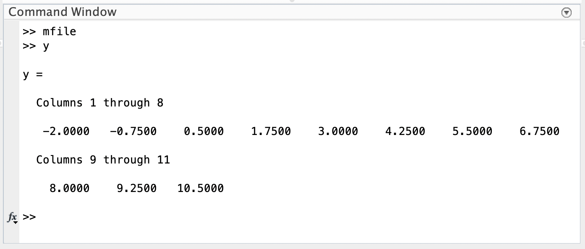

* What's the advantage to using an m file?
  + All of your code is saved!  
  + You can run it multiple times without having to retype anything.
  + You can leave yourself comments for next time you open the file.
  
  
  ```{block, type='rmdquestion'}
#### Question 1
  Go back to Chapter 11.  Create an m file to help you answer Questions 2 and 3.  Make sure to include comments.
```

## functions:

* Creating a function
  + `New` --$>$ `Script`
  + `File` --$>$ `Save As..`
  + Name your file (the .m will again automatically be added) and make sure it is saved in your `Current Folder`
    
    Note: MATLAB `functions` are a special type of `m file`
  + The first line of the file must tell MATLAB that this is a function.  Important parts include:
    1) The word `function`
    2) The function output(s) in square brackets
    3) The name of the function (*this MUST match the file name*)
    4) The function input(s)
    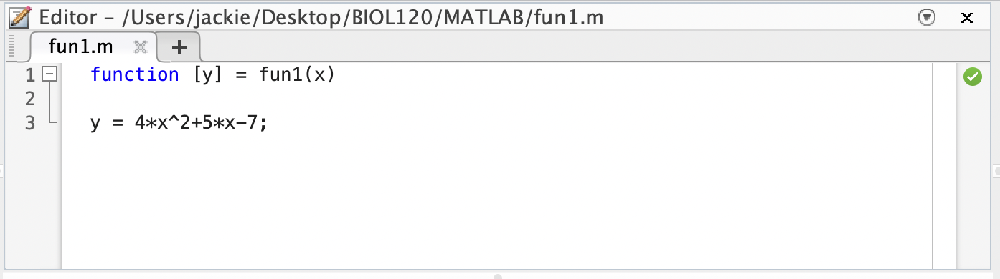
    

* Calling a function
  + Go back to the `Command Window`
  + Type in the name of your function and any input(s) in parentheses
  + When you hit enter, MATLAB will execute the function and display the output
  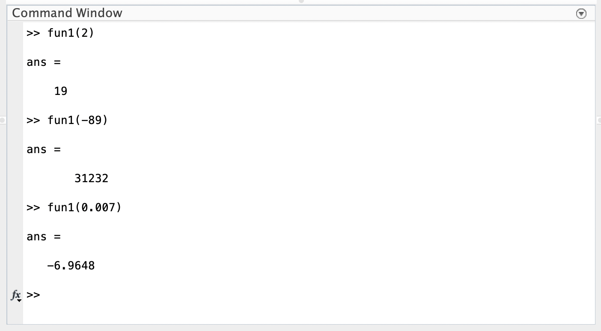
    ```{block, type='rmdquestion'}
#### Question 2
  - Write a MATLAB function that converts Celcius to Farenheit, according to the function $F\left(C\right) = \cfrac{9}{5}C+32$
  - What is the `independent variable` and what is the `dependent variable`?
  - Run your function to convert the following temperatures (given in $^{\circ}$C) to $^{\circ}$F.
  
          12$^{\circ}$ C, 26.4$^{\circ}$ C, and -6$^{\circ}$ C
```

* Writing a function with multiple inputs (multiple `independent variables` and/or `parameters`)
  + There are 2 standard ways of doing this
    1) have multiple inputs in a list, separated by commas
    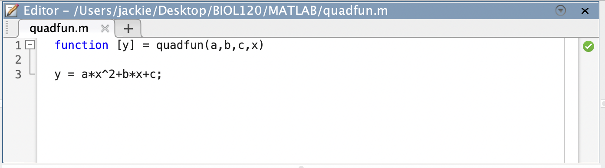
    2) have a 'single' input with multiple values - i.e. input a *vector* of inputs
    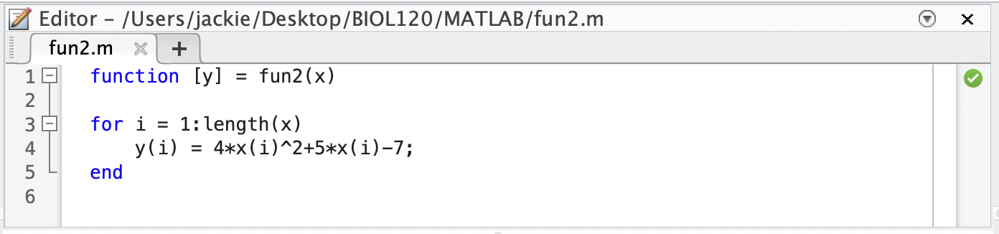
    Note: in this example, the output is also a vector.
    
* We can have multiple outputs in a list as well:
          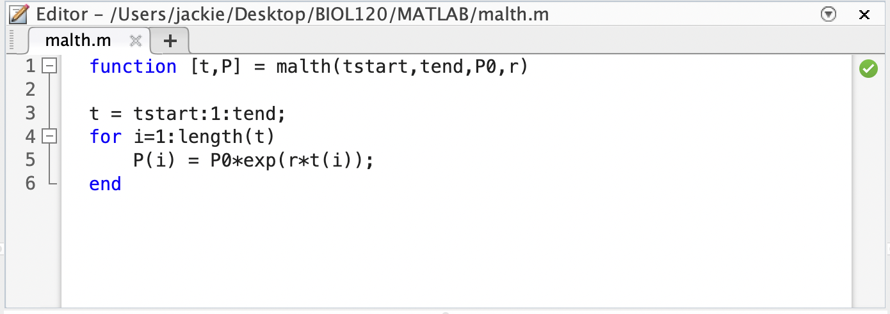
          
  What is the advantage to outputting a vector of independent variable values and a vector of corresponding dependent variable values?
  
  We can use them for plotting and visualize our model!
  
    ```{block, type='rmdquestion'}
#### Question 3
Lets think about modeling drug dosage.  If the recommended adult dosage for a drug is $D$ (in mg), then to determine the appropriate dosage $c$ for a child of age $a$ (in years), pharmacists use the equation $c = 0.0417D\left(a+1\right)$.

  - Write a MATLAB function that takes as inputs a range of ages (i.e. a vector of $a$ values) and the recommended adult dosage for a specific drug, $D$.  The function should output the appropriate dosages (i.e. $c$ values) for children of ages corresponding to the vector of $a$ values.  Hint: you may want to use a `for-loop` as in fun2 above.
  - Identify the `independent variable`, `dependent variable`, and `parameter`.
  - The recommended adult dosage for amoxicillin is 500 mg. Use your function to determine the appropriate dosage for children ages 2 - 12 years. 
```  
  
  
## Plotting function output / model predictions:

* Scatter Plots

  When dealing with two numerical variables (whether it is experimental data or simulated data), the best way to visualize their relationship is by using a scatter plot.  Luckily, this is very easy to do in MATLAB.
  
  Important things to know:
  - The MATLAB function to use is `scatter`
  - When using the `scatter` function, you need to make sure you input the `independent` and `dependent` variable values as vectors, in the correct order.  You also NEED THE VECTORS TO BE THE SAME SIZE!!!!  Why?  Because you are giving MATLAB the coordinates of points to plot.  If you try to scatter two vectors of different length, MATLAB will give you an error message.
  
  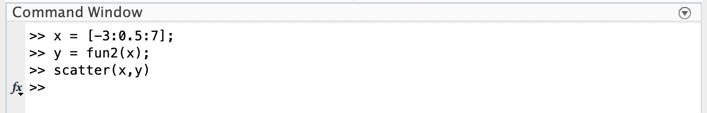
  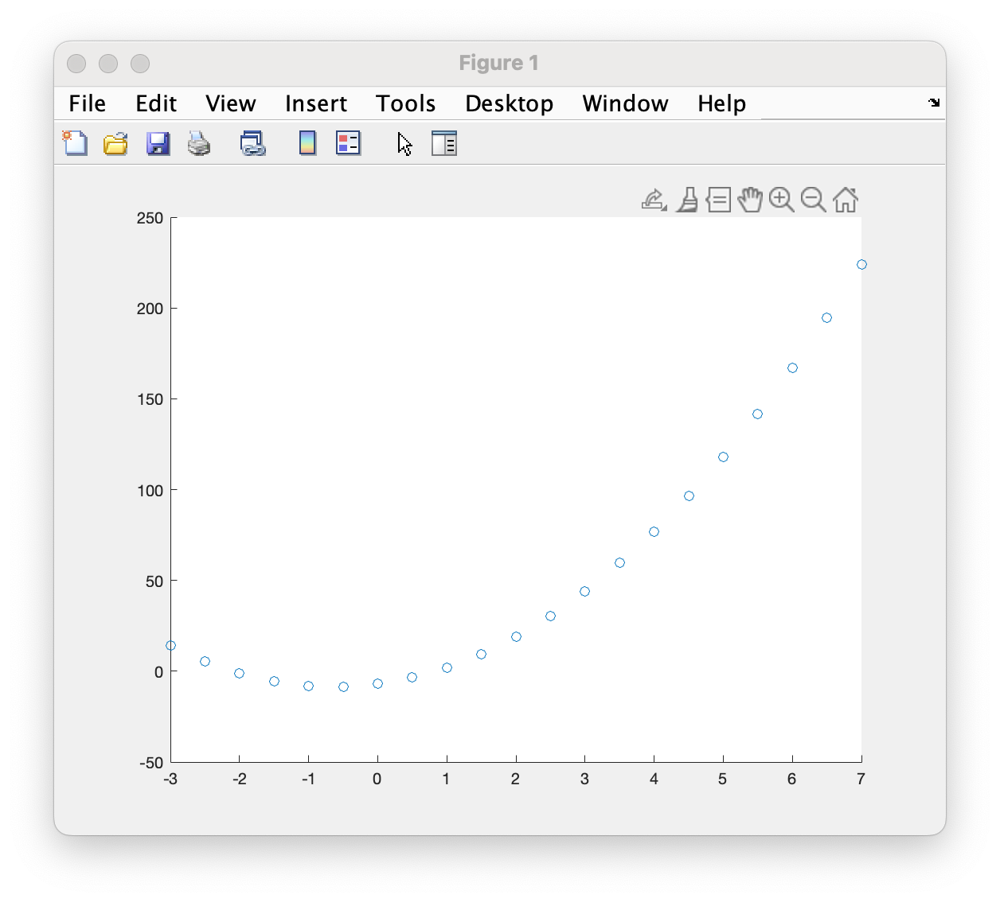
  
* Line Plots

  Sometimes we want to highlight trends in the relationship between two numerical variables.  Thus, instead of a simple scatter plot, we turn to a line plot.  This is a plot that connects the data points using line segments, and is the most popular way to visualize modeling results in MATLAB.
  
  Important things to know:
  - The MATLAB function to use is `plot`
  - The inputs for this function are the same as the `scatter` function.  When using the `plot` function, you need to make sure you input the `independent` and `dependent` variable values as vectors, in the correct order.  You again NEED THE VECTORS TO BE THE SAME SIZE!!!!  
  - Caution: 
    a) If you try to plot two vectors of different length, MATLAB will give you an error message.
    b) If you forget to include one variable (i.e. you only give the plot function a single vector input), it will simple plot that vector as the dependent variable values, assuming the independent variable values are simply 1,2,3,...

  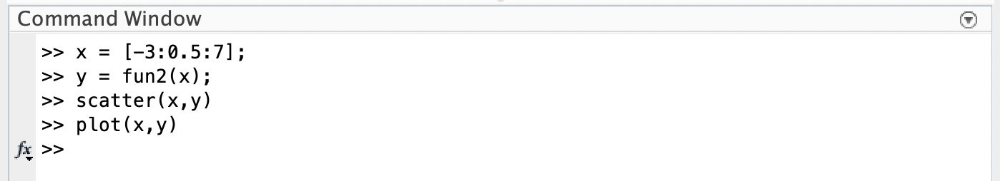
  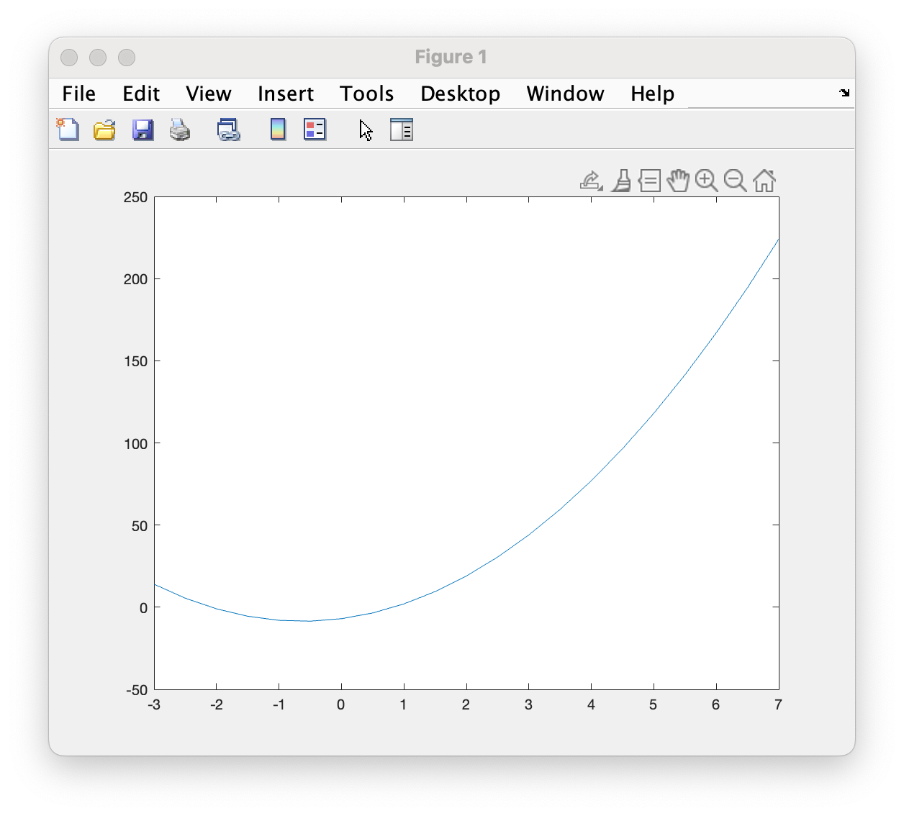
* Editing Figures in MATLAB

  There are lots of ways to edit Figures in MATLAB.  Next chapter, we will learn how to edit figures using various commands within mfiles, functions or the Command Window.  However, you can also edit plots interactively using the toolbar or drop-down menus of any figure.

  - You can add Axes Labels and a Title
    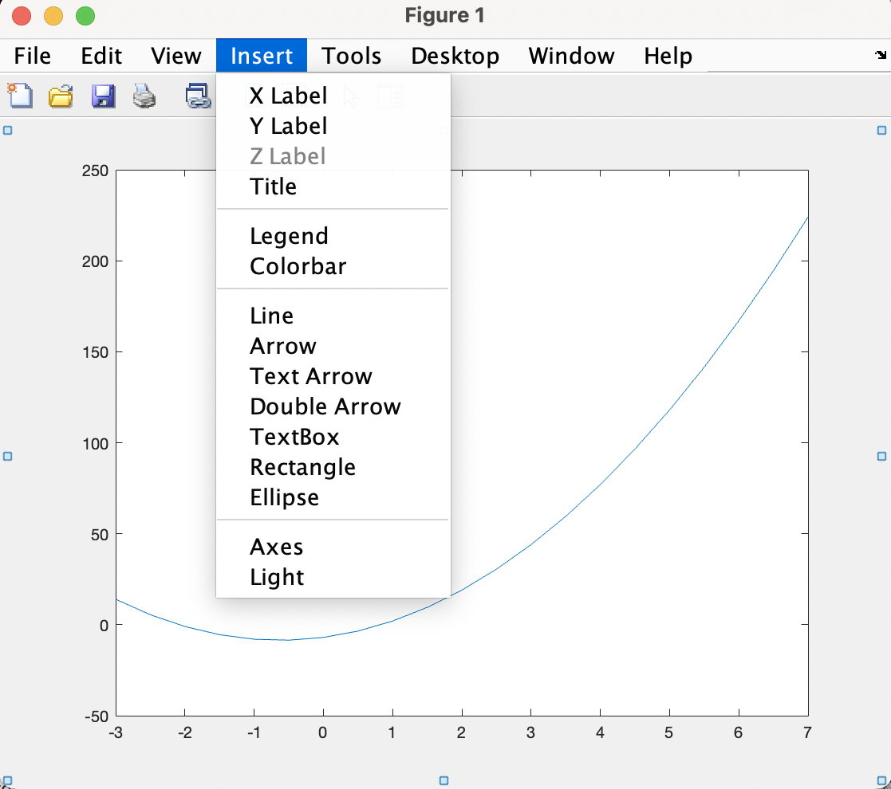
  - You can edit your Font Size or other Axes Properties
    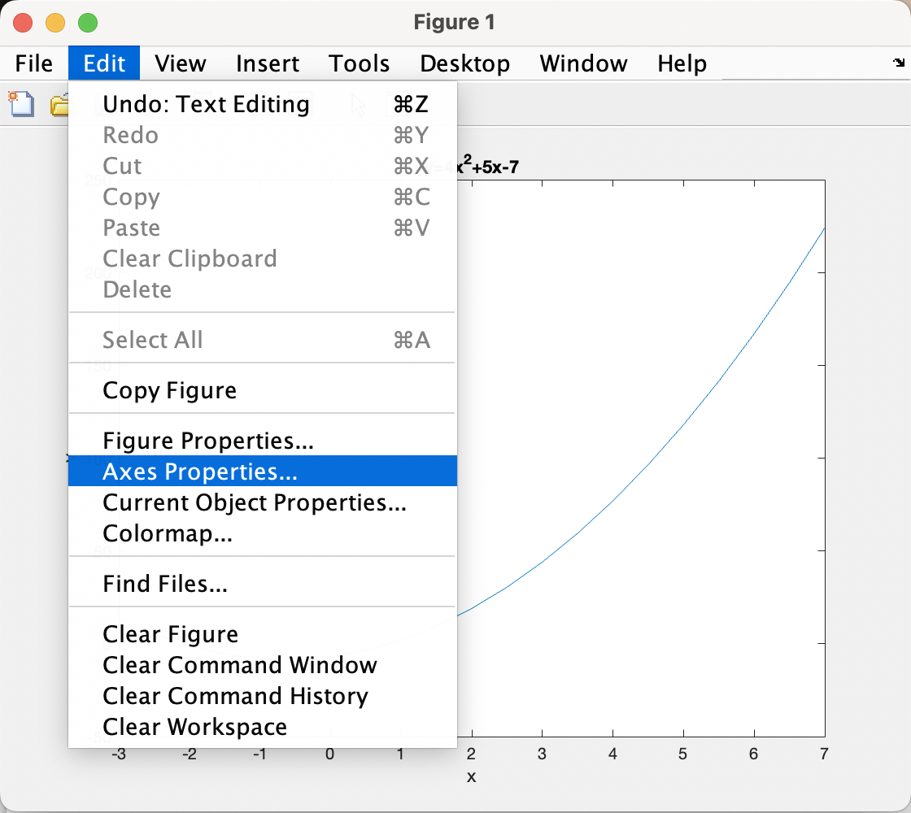
    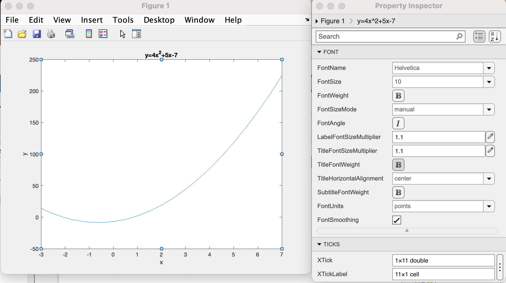
  - You can edit the color or width of the line by double clicking the line.
  
    Note: In a scatter plot, you can edits the `Markers` (i.e. circles corresponding to your data) by double clicking on any one of them.
    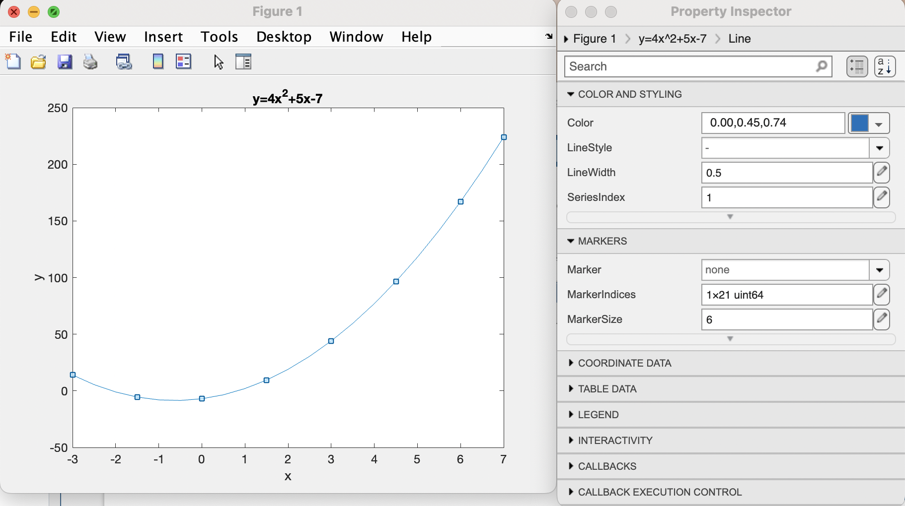
  - You can save your beautiful figure in many different formats with a simple `File` --$>$ `Save As..`
    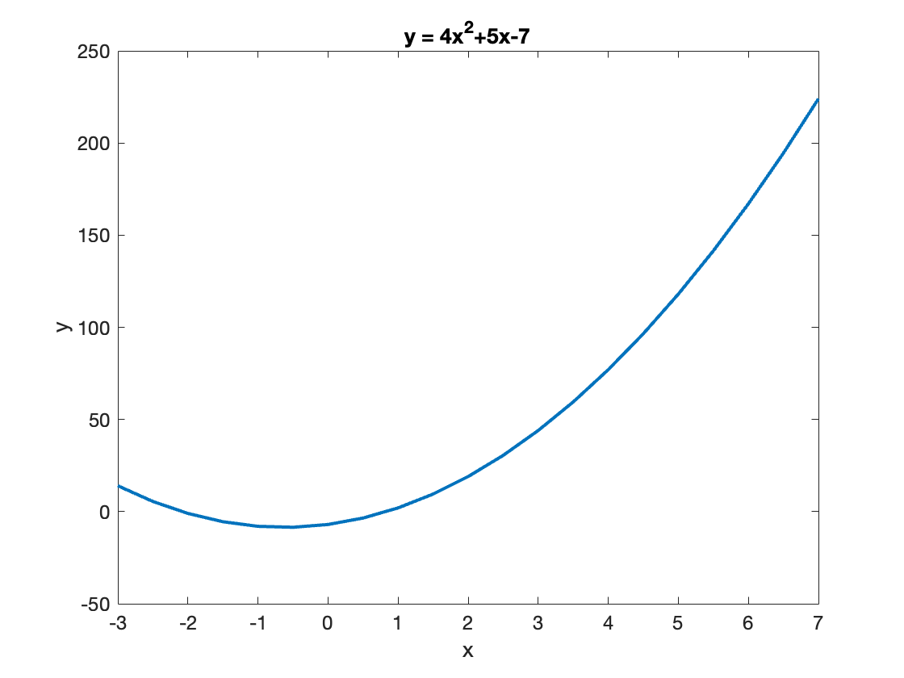
  
    ```{block, type='rmdquestion'}
#### Question 4
Using either a scatter plot or line plot to visualize your results from Question 3.

Make sure your plot has your axes labeled (with units) and includes a Title.
```  

    ```{block, type='rmdquestion'}
#### Question 5
Write an m file that uses your function from Question 2 and generates a figure (either a scatter plot or line plot) showing the relationship between temperatures measured in Celsius vs. Farenheit.  This graph should include a range of temperatures appropriate for someone trying to convert daily temperatures in Massachusetts over a typical calendar year.

Make sure your plot has your axes labeled (with units) and includes a Title.
```  
