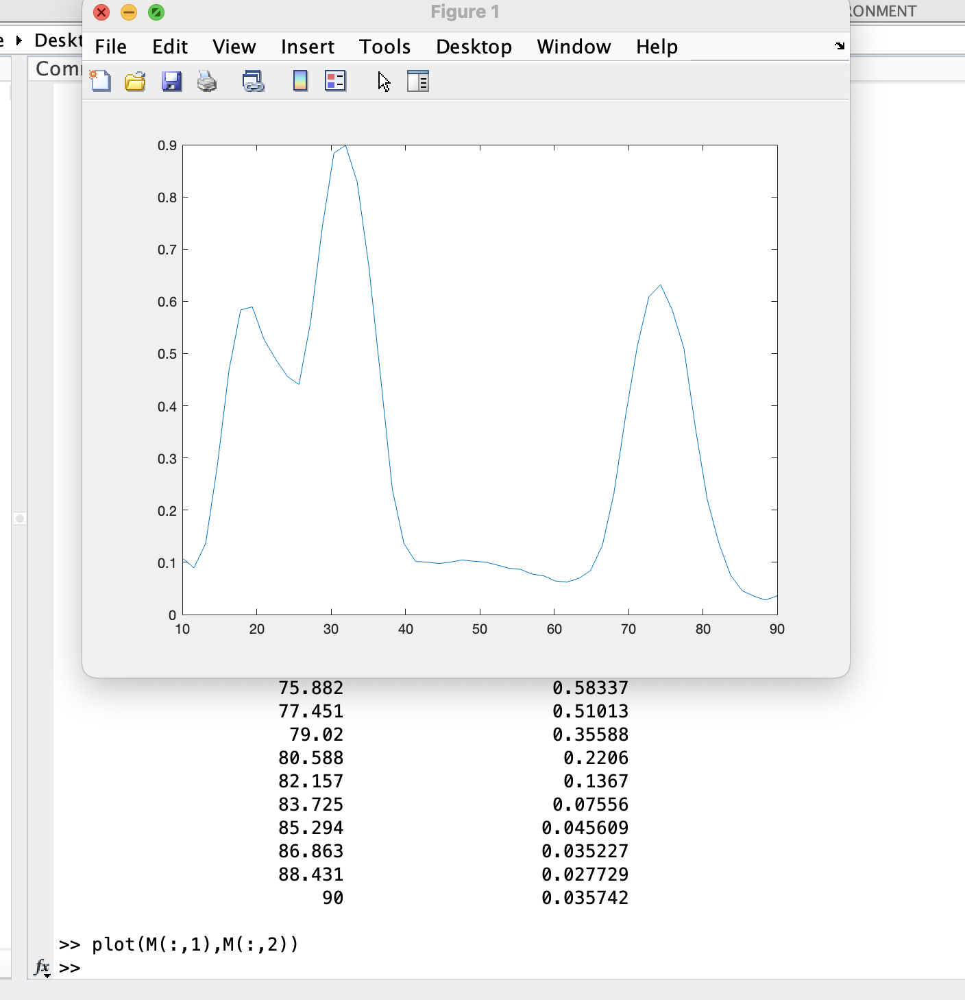

# Model Fitting (A.K.A. parameter estimation)


## Importing Numerical Data

* Using dlmread

  + The data must be in a delimited format (i.e. a matrix of values, with entries separated by spaces, tabs, or commas).
  + The data file must be in your `Current Folder`.
  + When using `dlmread()`, the filename needs to be in single quotation marks.
  + Save your data to a new variable when you read it into MATLAB (i.e. `D = dlmread('mydata.txt')`).
  
    Example:
    
    First we make sure the data file is in our `Current Folder`, use `dlmread()` to read it and save it to a new variable, D.  
    Note: We can then check that our data is indeed contained in the matrix D.
    
    
    
    If we want to visualize our dataset before moving on to model fitting, we can use the `plot()` command.
    
    Note: In this example, the first column of data contains the independent variable (\% AP) and the second column of data contains the dependent variable (normalized GT mRNA concentration).
    
  
  
  
  ```{block, type='rmdquestion'}
#### Question 1
  Download the *dicty* average growth data generated in the Larochelle Lab from the course moodle.
  
  Save this file in your `Current Folder`.
  
  Use the `dlmread()` command to read in the data and save it as a matrix (you can call this matrix whatever you want - i.e. I used D in the example above).
  
  Use a scatter plot to visualize the data.  
  * The first column is time (in hours), the second column is the corresponding population of AX4 cells (in thous. cells / mL), and the third column is the corresponding population of DnmA Knock Out cells (in thous. cells / mL).   
      Hint: To visualize both populations on the same figure, scatter one, then   
      `hold on` and scatter the other.      
  * Include a title and don't forget to label your axes.    
  * You can also add a legend using the drop down menu: `Insert -> Legend`.
```


## Creating a Model Function

Looking at your data, you now want to create a mathematical model to fit to your data.  We have seen two different models for population growth in class.  You may choose to fit one of these functions to the *dicty* average growth data or you may choose to create a new function based on something you have learned in another class or textbook.  Whatever model you choose, it will be important that you answer each of the following:

  1. Do you have a good reason for choosing your model?  It could be as simple as "my data seems to follow the shape of the curve generated by this model". 
  
  2. What are the underlying model assumptions?  i.e. The population has the ability to grow without bound.
  
  3. What are the independent variable(s), parameter(s), and dependent variable(s)?  This is where it is important to think about both the model (which will dictate parameter(s)) and the data (which will dictate how you choose independent vs dependent variables).
  
  4. Does the model do what I want it to do?  Before moving on to the next section of this chapter or thinking about fitting your model to data, make sure the function you wrote does what you want it to do!  You can check that it runs, gives the output in the format you expect, and even create some figures to see how the curve changes as you plug in different parameter values.

  ```{block, type='rmdquestion'}
#### Question 2
  Create a model in MATLAB that you will use for the *dicty* growth data.  
  
  Note: You will want to create a single MATLAB function to use on both data sets.  The model parameters are what should change the shape of your curve. In the last section, we will learn how to fit the correct parameter values in order to obtain one set of parameter values for the AX4 cells and another set for the DnmA KO cells.
  
  After creating your model function, answer each of the 4 questions above.
```

## Creating an Objective / Error Function

For Model Fitting, we need an Objective Function (which we will minimize).  The most popular Objective Function is the Error Function calculated by taking the Sum of Square Errors (SSE):
$$SSE = \sum_{i=1}^n \left(y_i - m_i\right)^2$$
Luckily, MATLAB has a function that sums square terms of a vector for us, `sumsqr()`.

Examples:

1)  


        Note: $1^2+2^2+3^2+4^2 = 30$  
      
2)  


        Note: $\left(1-1.4\right)^2+\left(2-1.7\right)^2+\left(3-2.9\right)^2+\left(4-4.2\right)^2 = 0.3$
        
To create an Objective Function, the function needs to take the model parameter(s) and experimental data as input.  The output should always be a *single number*, the SSE.

Example:

Lets assume we have some experimental data of the position of a frog as it jumps.  We upload the data in to MATLAB and use a scatter plot to visualize.

Just looking at the data's shape, we suggest using a quadratic model to fit this data.  (This also fits what we have learned about projectile motion in Intro Physics.)

Next, we write the model function:

Now we need to write our Objective Function to calculate the error between the model and experimental data.  The Objective Function should take as input: our parameter(s) as a *single vector* and our experimental data.  It should output a *single value*, the SSE.

Before moving on, we should run the Objective Function (with any parameter values we choose for now) just to make sure it runs and outputs a single number with no errors.

        
```{block, type='rmdquestion'}
#### Question 3
  Create an objective function in the following way: 
  
  + The input should be the model parameter(s) as a single vector and the experimental data (as two vectors, values for the dependent variable and independent variable).
  + The function should run the model you created in Question 2 with the parameter(s) given and vector of dependent variable values.
  + The function should then calculate the SSE between the model output and the experimental data.
  + The output should be the SSE value.
```
        
## Fitting your Model to your Data

We have experimental data, a mathematical model, and an objective funciton: now what?

Now we need to find the parameter values that minimize that objective function.

There are many ways to do this.  In this section we will learn how to implement a local method of parameter estimation in MATLAB.  Local methods take an initial guess for the parameter values and search nearby using techniques from Calculus or Geometry.  In MATLAB, the most common function to use is `fminsearch()`.  This function uses the Nelder-Mead simplex algorithm, but you don't have to worry about that for this course.  Just focus on how to run it.

### Running fminsearch()

The `fminsearch()` function has many different options available when running it.  Since our Objective function takes multiple inputs and we only want to fit the parameter value(s), will run it using the following commands / syntax:

`[x,fval] = fminsearch(@(p)function_name(p,t,y...),p_0);`

Notes:    

* `p_0` is your initial guess for the parameter value(s).  This needs to be a vector and parameters need to be given in the SAME order as they are input into your function (i.e. the same as `p`)
    
* `x` is a vector of parameter values that best fit your data
    
* `fval` is the SSE between your data and the model when `x` is used for the parameters in your model
  
Example:


```{block, type='rmdquestion'}
#### Question 4
  Run `fminsearch()` using the *dicty* growth data from Question 1 and your Objective Function from Question 3 to find the parameter values. 

Note:

  + You will have to do this TWICE since we have two data sets, the AX4 cells and the DnmA KO cells.
  + The growth data is different for these two data sets, so you should get two DIFFERENT sets of parameters.
  + Although this can all be done in the Command Window, you will want to use an mfile so you can edit, add comments, and save your commands.
```

### Visualizing the Best Fit

Once you have the optimal parameter values, you will want to see how good your fit looks with your data.  You will do this in 3 steps:

1) `scatter()` the experimental data (independent vs. dependent variables).  Don't forget to `hold on` to the figure.
2) Run the model with the parameter values that gave you the best fit.  You can either use the vector of independent variable values from your experimental data or create your own vector (just make sure it includes a range of independent variable values that include those given in your data set).
3) `plot()` the model results and label your figure.

Example:


```{block, type='rmdquestion'}
#### Question 5
  Create a visualization for your model fits to the *dicty* growth data.
  
  You can do this either:
  
  1) using two figures, one for the AX4 cells and one for the DnmA KO cells.  
  
  OR
  
  2) using a single figure with both sets of experimental data and both model fits.  
  
  Make sure to include axes labels and a Legend!
```
