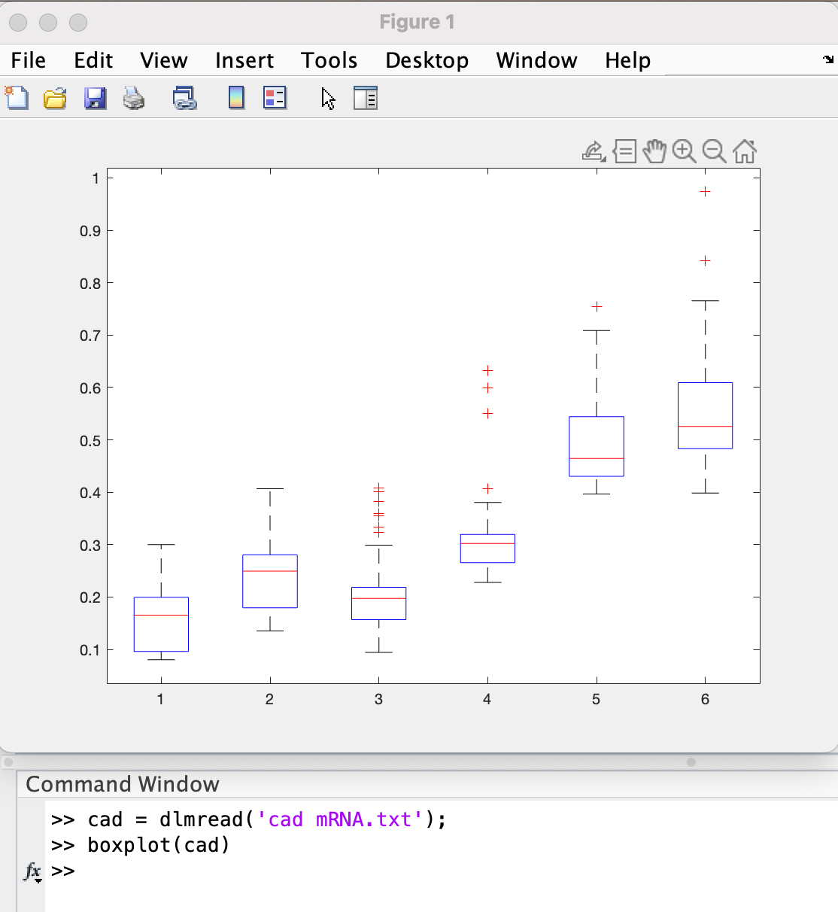

# Investigating a Numerical Data Set

Large data sets are saved in many different formats.  The BDTNP data has been organized into separate files for each mRNA species.  In each file, the columns correspond to different timepoints in development (70, 80, 90, 100, 110, and 120 minutes).  The rows correspond to the 52 nuclei in the middle of the embryo (50% Dorsal-Ventral) from 10 - 90% Anterior-Posterior.  Each value is the average normalized mRNA concentration.


## Extracting (and Combining) Subsets of Data

When dealing with data in this format (i.e. a matrix), remember:

* If I have a matrix, `M`, and I want to extract a single columnm (for example, column 2), I can use the command:

`M(:,2)`

* If I want to extract a single row (for example, row 26), I can use the command:

`M(26,:)`

* This also means I can combine subsets of my data.
  + Example:
    If I want eve mRNA and ftz mRNA at 100 minutes (i.e. timepoint 5) into development in a new matrix, M, I type:<br />
              {width=600px}
  
    
  

```{block, type='rmdquestion'}
#### Question 1
  Download the data files (there are 8 total mRNA data files) and the BDTNP.m file from the course moodle.

a) Plot at least one mRNA concentration at all 6 timepoints (using `hold on` after you plot the data from the first timepoint).

b) Plot all 8 mRNA concentrations at a single timepoint.  (Hint: Make sure you use a timepoint that you have data for all 8 mRNAs for).

For both figures, make sure to include axes labels and a legend.
```


## Simple Summary Statistics

* Using min(), max(), mean(), median(), or mode() on a matrix of data returns a vector containing the minimum, maximum, mean, median, or mode respectively of each COLUMN. <br />
  Example: <br />
{width=800px}

* If you want the min, max, mean, median, or mode of each ROW, there are two ways of doing this:<br />
    1) Use the same commands on the *transpose* of the matrix (i.e. M')<br />
        Example:<br />
          `min(M')`<br />
    OR<br />
    2) You can call the same commands across the second dimension <br />
        Example for min or max:<br />
          `min(M,[],2)`<br />
        Example for mean, median or mode: <br />
          `mean(M,2)`
          
* To visualize the spread of data, one often uses a box plot.  To do this in MATLAB, use the `boxplot()` command.  
When using `boxplot()` with a matrix of data, each box summarizes a column of data, the central mark indicates the median, and the bottom and top edges of the box indicate the 25th and 75th percentiles, respectively. The whiskers extend to the most extreme data points not considered outliers, and the outliers are plotted individually using the '+' marker symbol.<br />
  Example: <br />
  
  

```{block, type='rmdquestion'}
#### Question 2

a) Scatter the 6 timepoints vs. the maximum mRNA concentration across all nuclei (Note: time should be the independent variable and maximum mRNA concentration should be the dependent variable).  You can do this for a single mRNA or show the data from multiple mRNA on a single figure (just remember to use the command `hold on` after your first scatter command)

b) Create a box plot for one of the mRNA concentrations.  What observation(s) can you make from your figure?  (Hint: Possible observations could include a general trend as time increases or a change in the spread of the data from one timepoint to another).

For both figures, make sure to include axes labels.  If you have more than one mRNA on a single figure, make sure to include a legend also.
```

## Writing / Saving Numerical Data
  
* Any numerical data you have in a matrix, `M`, can be written to a tab-delimited file (i.e. one you can open with Notepad, Atom, or Excel) with one easy line of code: <br />
`dlmwrite('mydata_name.txt',M)`

Note: Your file will be saved in your `Current Folder`. 
  
```{block, type='rmdquestion'}
#### Question 3
 
a) Take the data you plotted in Question 1 b), organize it in a matrix, and save it as a .txt file using `dlmwrite()`.

b) Take the data you plotted in Question 2 a), organize it in a matrix, and save it as a .txt file using `dlmwrite()`.

```
  
  